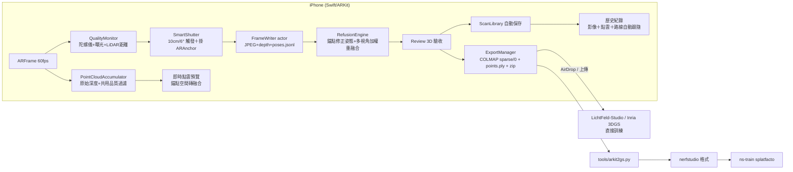

# fable — COLMAP-free 3DGS 採集 + 手機端訓練

用 iPhone ARKit（＋LiDAR）直接在手機端取得 **RGB 影像 + 精準相機內外參 + 初始化點雲**，
完全跳過 COLMAP SfM，**並可直接在手機上訓練成 3D Gaussian Splatting、當場拖曳檢視**——
不需電腦、不需上傳。也可匯出標準 COLMAP 資料集送桌機訓練。

```
掃描 → 手機上按「訓練成 3DGS」→ 拖曳轉動檢視 → 匯出 .zip
（或）掃描 → AirDrop 一個 zip → ns-train splatfacto，中間沒有任何 SfM 等待時間
```

| 傳統管線 | 本系統 |
|---|---|
| 拍影片 → 抽幀 → COLMAP SfM（數十分鐘～數小時，可能失敗） | ARKit VIO 即時輸出姿態（0 秒） |
| 姿態品質依賴特徵匹配，弱紋理場景直接崩潰 | VIO 融合 IMU，弱紋理仍穩定 |
| 尺度任意（scale ambiguity） | 公制尺度（公尺），LiDAR 加持 |
| 拍壞了回家才知道 | 即時品質警告＋涵蓋率視覺化，現場補拍 |

---

## 本次更新：掃描穩定性、歷史管理與同步回放（2026-09-18）

本次改動涵蓋從開拍、停止後融合、歷史保存到回放的完整流程。主要變更如下：

| 範圍 | 具體改動 | 操作方式／效果 |
| --- | --- | --- |
| ARKit 工作階段 | 集中設定與相機狀態，處理權限、背景、中斷、重新定位及安全停止 | 相機就緒後才允許開拍；追蹤不穩時暫停抓幀 |
| 點雲融合 | 共用深度過濾、實測優先、錨點跨格修正、剛性旋轉與受驗證的 BA | 減少邊緣雜點、重複融合及補點拉偏實測資料的風險 |
| LiDAR 實驗 | 新增開拍前的「LiDAR 深度掃描」開關，硬體能力與本次模式分開保存 | 同一支手機分別收集開／關資料，歷史列表可辨識模式 |
| 歷史紀錄 | 停止後自動保存預覽，支援舊版資料、點雲預覽與打包分享 | 首頁 →「掃描紀錄」→ 選擇一次掃描 |
| 完整刪除 | 單筆、多選、全選及全部刪除；確認筆數、失敗回報、未選資料保留 | 刪除整個掃描資料夾與同名 ZIP，照片和模型一起清除 |
| 影像／點雲回放 | 雙畫面、路線標記、可調 FPS、播放／暫停、拖曳進度、全螢幕與自動跟隨 | 「拍攝影像」分頁可對照照片和拍攝空間位置 |
| 寫入與匯出 | 寫入成功才計數，停止時等待工作完成，ZIP 先寫暫存再發布 | 避免假成功、未寫完就匯出及失敗覆蓋既有 ZIP |

### ARKit 與融合精度改動

- **相機狀態與資料階段分離**：`CaptureSessionState` 表示權限、追蹤與中斷；`CaptureController` 協調掃描、融合、驗收、訓練及匯出。開始掃描與自動快門共用就緒條件。
- **追蹤穩定閘門**：連續正常追蹤 0.6 秒後才接受影像；追蹤丟失或影格間隔過長會重新等待，避免剛恢復時立即累積不穩定資料。
- **一致的深度品質判定**：即時預覽優先使用原始 `sceneDepth`；與離線重融合共用四向邊緣、信心值、入射角及模糊權重，原始深度不可用時才回退平滑深度。
- **實測資料優先**：mesh 只填補缺少深度量測的格子；取得實測後取代補點，合併 voxel 時也維持優先序。
- **錨點修正**：依校正後的位置尋找空間磚，減少跨世界網格邊界後重複建磚；停止時套用所有錨點的最終姿態。
- **精細掃描**：預設啟用；有 LiDAR 時在背景執行 6 輪局部 BA，只有通過保留集驗證的結果才套用。完整旋轉增量避免一階近似累積尺度／剪切誤差；代價是停止後需要較多處理時間。
- **安全停止及重試**：停止後先等待寫入、特徵處理與點雲工作完成；RoomPlan 暫停完成才開放續掃。寫檔／匯出失敗會回報並保留可重試資料，舊工作回呼不能修改下一次掃描。

上述改動已有合成資料與回歸測試支持，尚未量測真實場景的絕對尺寸誤差，不宣稱固定公分精度或效能提升。

### 歷史紀錄與完整刪除

停止掃描後會保存 `review.ply`、`review-poses.jsonl`、`scan-summary.json`，不必先匯出即可在首頁重新開啟。舊版掃描直接從磁碟列出；若只有原始深度，會在限定預算內重建預覽；只有照片時仍能瀏覽照片。歷史點雲預覽最多顯示 120,000 點。

- **多選**：按「選取」→ 勾選紀錄或「全選」→「刪除所選」。
- **全部刪除**：列表底部按「全部刪除」，確認視窗顯示即將刪除的筆數。
- **刪除範圍**：選定掃描的照片、深度、姿態、點雲、Gaussian 模型 `gaussians.ply`、平面圖 `floorplan.usdz`／JSON／SVG／DXF、COLMAP 資料及同名 ZIP。
- **失敗處理**：整批路徑先驗證，重複項目只處理一次；部分失敗回報成功／失敗筆數並重讀列表。全部刪除只處理確認時的紀錄，不包含之後新增的掃描。
- **資料界線**：不刪除未選掃描、系統相簿或已分享至其他 App 的副本。歷史預覽不能恢復已離開的即時掃描工作階段。

歷史「打包分享」會封裝現存檔案；若尚未執行正式匯出或訓練，不保證 ZIP 已含 COLMAP 資料或 Gaussian 模型。

### 拍攝影像與 3D 點雲自動同步

在「掃描紀錄」→ 任一掃描 →「拍攝影像」中，直向以上下雙畫面顯示，橫向／寬螢幕以左右雙畫面顯示。

1. **同步標記**：綠色線顯示拍攝路線，橘色視錐標出當張照片的位置與方向。照片依檔名配對校正後姿態，缺少影格不會讓後面的照片對錯位置。
2. **自動跟隨**：播放時，3D 視角從拍攝位置斜後上方跟隨，以短暫平滑過渡同步位移與轉向；切換上一張／下一張或拖曳進度也會定位到對應位置。
3. **查看完整路線**：按取景框圖示可暫停播放並恢復全景；定位箭頭可切換跟隨。暫停時可以手動旋轉、縮放和平移，再按播放恢復跟隨。
4. **播放控制與 FPS**：速度選單提供 **0.5、1、2、5、10、15、30 fps**，預設 **2 fps**，播放中可立即切換，維持目前影格；全螢幕共用速度設定。支援播放／暫停、進度拖曳、前後影格；到最後停止，重新播放從第一張開始，離開畫面或進入背景會暫停。
5. **缺資料回退**：沒有姿態會顯示提示並停止自動定位；沒有點雲但有姿態仍能查看路線，不捏造位置資料。

依設定 FPS 逐張播放已儲存的關鍵影格，**不是原始等速影片**；畫面同時顯示相對拍攝時間。跟隨動畫最多 0.25 秒，且不超過影格間隔的 80%。10 fps 以上播放時使用較小的影像預覽，暫停後恢復較高解析度；實際速度仍受裝置解碼及渲染負載影響。切換影格只更新標記與相機，避免重建整份點雲。

### LiDAR 開／關的比較方式

開拍前切換「LiDAR 深度掃描」，掃描期間無法切換，避免混用資料。切換會重設 AR 工作階段，並取消沿用上次世界地圖。

| 模式 | 保存及使用的資料 |
| --- | --- |
| 開啟 | RGB、相機姿態、深度與融合點雲；依設定使用 mesh、RoomPlan 及精細姿態校正 |
| 關閉 | RGB、相機姿態、稀疏特徵點雲；不請求深度／mesh，不啟動 RoomPlan、不儲存深度 |

`meta.json` 的 `lidarAvailable` 記錄硬體能力，`lidarEnabled` 記錄本次模式。比較時固定路徑、光線、距離及相機設定，兩次皆先關閉「精細掃描」，再另測校正效果；檢查覆蓋範圍、牆面厚度、重影與已知物件的尺寸誤差，不能只比較點數。

關閉的是 App 請求及使用的深度功能，不能保證 ARKit 內部完全不用 LiDAR，也不是感測器電源控制；目前亦未加入純 RGB 稠密重建。

### 驗證與已知限制

| 驗證 | 結果／範圍 |
| --- | --- |
| iOS Simulator 建置 | 最新 FPS／自動跟隨完整版本通過，未簽章 |
| iPhone 建置 | 最新完整版本的 `iphoneos` SDK 未簽章建置通過；不代表真機感測器驗證 |
| `test_capture_pipeline.swift`（4 組） | JPEG／JSONL 寫入、失敗重試、ZIP 原子發布、關閉後拒絕寫入 |
| `test_capture_accuracy.swift`（18 項） | 追蹤穩定、深度過濾、旋轉、實測優先、錨點跨格修正 |
| `test_scan_library.swift`（8 組） | 舊資料、預覽、完整多選／全部刪除、確認快照及路徑檢查 |
| `test_scan_playback.swift`（4 組） | 檔名配對、缺圖／壞姿態、校正後座標與舊資料回退 |
| `test_playback_camera.swift`（5 組） | 跟隨朝向、平移、轉彎、垂直仰俯拍及無效姿態 |
| `test_playback_timing.swift`（2 組） | FPS 間隔、動畫時間界限與無效速度回退 |
| `test_bundle_adjust.swift`（8 項）／`test_voxel_shard.swift`（5 組） | 保留集品質驗證與分片融合一致性 |

上述回歸測試在本次開發過程中通過。原有單筆歷史 UI 已用合成資料驗證列表、點雲、照片切換、刪除確認與打包；後續多選、雙畫面回放、FPS 調整及自動跟隨的實際點擊／排版驗證，因 Simulator UI 自動操作連線逾時尚未完成。LiDAR 開關效果、實際精度、長掃描記憶體與溫度仍須真機測試。

詳細架構、不變條件及驗證方式見 [掃描架構與操作流程](docs/CAPTURE_ARCHITECTURE.md)。

---

## 0. 手機端直接訓練 3DGS（on-device）

掃完後在手機上按「**訓練成 3DGS**」，直接在裝置的 GPU 上跑 Gaussian Splatting 訓練，
完成後**拖曳（trackball）自由轉動檢視**，滿意再匯出。全程不需電腦、不需上傳。

```
掃描 → 點雲優化(processing) → 驗收(review) → 訓練成 3DGS(training) → 拖曳檢視 → 匯出/重訓
```

- **訓練器**：vendored [msplat](https://github.com/rayanht/msplat)（純 Metal 的 3DGS 訓練引擎，Apache-2.0），
  編進 app（`fable/Training/msplat/`）。輸入直接吃 fable 自產的 COLMAP（`sparse/0` + `images/`），
  `points3D`（LiDAR 彩色點雲）當初始化 —— 零轉換。
- **即時預覽**：訓練中每數十步 render 一張，看它「越訓越清晰」；可即時拖曳轉動（trackball）。
- **記憶體/散熱**：高斯數設硬上限、訓練影像降採樣常駐、過熱自動暫停；並開啟
  `com.apple.developer.kernel.increased-memory-limit` entitlement。
- **裝置需求**：建議 **iPhone 15 / 16 Pro 以上**（8GB RAM + LiDAR）。
- **可調參數**（`fable/Capture/CaptureConfig.swift`）：`trainIterations`（預設 6000）、
  `trainSHDegree`（目前預設 3，可降低以節省成本）、`trainMaxGaussians`（預配置容量，預設 30 萬）、
  `trainDownscale`（訓練影像降採樣）、`trainThermalThrottle`。記憶體不足就把前兩者調小、downscale 調大。

> 匯出的 `.zip` 內含 `gaussians.ply`（訓練結果）＋標準 COLMAP 資料集，可另在桌機用
> LichtFeld-Studio / Inria 全力再訓練得到更高品質。

---

## 1. UI/UX 互動流程

開拍前可切換 LiDAR，關閉時保留 RGB、相機姿態與稀疏特徵點雲；每次掃描的模式會記錄於歷史紀錄。停止後自動保存預覽，首頁「掃描紀錄」可查看點雲、同步回放照片與拍攝路線、分享，以及多選或全部刪除照片與模型。

相機生命週期、精度改進、LiDAR 比較方式、寫入／匯出失敗處理與驗證方式見 [掃描架構與操作流程](docs/CAPTURE_ARCHITECTURE.md)。

```text
首頁 → AR 預覽（LiDAR 開關／精細掃描）→ 開始掃描 → 停止與點雲優化 → 驗收
                                                                      ├─ 繼續掃描
                                                                      ├─ 訓練成 3DGS
                                                                      └─ 正式匯出 ZIP
首頁 → 掃描紀錄 → 點雲預覽／影像與路線同步回放 → 分享／單筆、多選、全部刪除
```

**驗收（Review）階段**是品質守門員：停止掃描後手機先做「姿態修正＋重融合」，
再以 3D 檢視器呈現**實際會匯出**的點雲與相機軌跡 —— 看到破洞按「繼續掃描」回到
同一世界座標補拍（ARKit 自動重新定位），確認滿意才打包分享，不浪費一次上傳。

掃描中的 HUD 各元件與觸發條件：

| 元件 | 觸發 | 視覺 |
|---|---|---|
| 警告膠囊（頂部） | 追蹤丟失 / 移動過快 / 過暗 / 過亮 / 過近 / 過遠 / 過熱 | 兩級制：橘 = 提醒（照拍）、紅 = 遮斷（暫停抓幀，模糊 >16px 或追蹤丟失）+ 觸覺回饋 |
| 全螢幕紅框 | 遮斷級警告（抓幀暫停中） | 紅色描邊呼吸提示 |
| 速度儀 | 每幀更新「動態模糊風險」= (ω + v/z)·f·t_exp | 龜→兔進度條，綠（<8px）→橘→紅（>16px） |
| **即時點雲疊加** | 每 0.1 秒連續加權融合 LiDAR 原始深度（不可用時才回退平滑深度；與快門解耦） | 彩色點雲貼在被掃表面上（1cm voxel、飛點過濾、模糊閘門）；按 1.2m 空間磚掛 ARAnchor —— 漂移校正時點雲隨錨點修正位置；左上角按鈕可開關 |
| 軌跡折線＋視向箭錐 | 每個關鍵幀 | 青色線框錐 = 已拍視角 |
| 統計面板 | 持續 | 幀數 / 點數 / 涵蓋 % / 預估容量 |

**智慧快門**：每移動 10cm **或** 轉動 6° 自動存一幀（可調），而非固定 fps —— 原地不動不浪費儲存，移動快慢自動適應，視角分佈天然均勻。品質不合格（模糊/追蹤丟失）時快門暫停，條件持續成立、恢復即補拍。

## 2. 資料管線



經正式匯出的 zip 內容（`scan_yyyyMMdd_HHmmss/`）—— **含標準 COLMAP 資料集**；歷史直接打包則以已存在的檔案為準：

```
images/frame_00001.jpg        # 1920×1440 sensor 方向 RGB（訓練影像）
sparse/0/cameras.bin          # PINHOLE 內參（COLMAP binary 格式）
sparse/0/images.bin           # w2c 姿態：四元數(wxyz)+平移，OpenCV 相機慣例
sparse/0/points3D.bin         # 擇優下採樣後的 LiDAR 彩色點雲（3DGS 初始化）
points.ply                    # 同一點雲的 PLY 副本（快速檢視 / nerfstudio 種子點）
depth/frame_00001_depth.bin   # 256×192 float32 原始深度（sidecar，訓練器忽略）
poses.jsonl / meta.json       # 原始感測紀錄、硬體能力及本次 LiDAR 模式
review.ply                   # 停止後自動保存的預覽點雲
review-poses.jsonl           # 對應預覽的校正後姿態，供照片／路線同步
scan-summary.json           # 歷史列表使用的影格／點數摘要
gaussians.ply               # 完成訓練後才有的 Gaussian 模型
floorplan.usdz              # 啟用對應 RoomPlan 輸出且成功後才有的模型
```

**最短路徑：zip 解壓後直接把資料夾丟給 [LichtFeld-Studio](https://github.com/MrNeRF/LichtFeld-Studio) 或 Inria `train.py -s`，零轉換。**`tools/arkit2gs.py` 提供進階重處理（品質過濾、portrait 旋正、世界軸重定向、nerfstudio 格式、深度重建點雲）。

> **上下方向**：`sparse/0` 預設已繞世界 X 軸翻 180°，對齊 COLMAP/3DGS 慣例 —— ARKit 原生 +Y-up 直接匯入會顛倒（詳見 [docs/COORDINATES.md §3.1](docs/COORDINATES.md)）。若你的 viewer 反而變顛倒，Swift 端設 `CaptureConfig.flipWorldUpForExport = false`、Python 端加 `--no-colmap-flip-up`。`points.ply` 保留 ARKit +Y-up 原生幀。

## 3. 專案結構

```
fable/
├── fable.xcodeproj / fable/          # iOS App（Xcode 26+，iOS 17+，建議 iPhone Pro 系列）
│   ├── ContentView.swift             # 首頁
│   ├── Training/                     # 手機端 3DGS 訓練：MsplatTrainer.swift（Swift 包裝）
│   │   └── msplat/                   #   vendored msplat（Metal 3DGS 訓練器，Apache-2.0）
│   ├── History/
│   │   ├── ScanLibrary.swift         # 保存、舊資料預覽、批次刪除與照片姿態配對
│   │   ├── ScanHistoryView.swift     # 歷史列表、多選／全部刪除與詳細預覽
│   │   ├── ScanRoutePlaybackView.swift # 影像／點雲雙畫面與播放控制
│   │   ├── PlaybackCameraPose.swift # 跟隨拍攝位置與方向的相機姿態
│   │   └── ScanPlaybackTiming.swift # FPS 選項、影格間隔與跟隨動畫時間
│   └── Capture/
│       ├── CaptureController.swift   # 工作階段協調、LiDAR 模式與熱路徑抓幀
│       ├── CaptureSessionState.swift # 相機權限／追蹤狀態
│       ├── CaptureSessionConfiguration.swift # ARKit 深度／網格設定工廠
│       ├── DepthSampleFilter.swift   # 共用深度過濾與追蹤穩定閘門
│       ├── QualityMonitor.swift      # 角速度/模糊/光線/距離/散熱監控
│       ├── SmartShutter.swift        # 距離+角度差抓幀決策
│       ├── FrameWriter.swift         # actor：背景 JPEG/深度/姿態寫入
│       ├── PointCloudAccumulator.swift # actor：LiDAR 反投影→voxel→PLY
│       ├── CoverageVisualizer.swift  # SceneKit 軌跡+視角圓頂
│       ├── ExportManager.swift       # COLMAP、PLY、JSONL 與原子 ZIP 發布
│       └── UI/                       # CaptureView + HUDOverlay
├── tools/                            # Python 3.10+（numpy + Pillow）
│   ├── arkit2gs.py                   # 主轉換器 → nerfstudio / colmap
│   ├── geometry.py                   # 座標系轉換核心（含完整推導註解）
│   ├── colmap_io.py / ply_io.py      # 格式讀寫
│   ├── validate_dataset.py           # 資料集健檢
│   ├── make_synthetic_scan.py        # 合成資料（無手機也能測管線）
│   ├── test_math.py                  # 座標數學自動驗證
│   └── test_*.swift                  # 寫入、融合、歷史刪除與回放回歸測試
└── docs/
    ├── CAPTURE_ARCHITECTURE.md       # 工作階段、融合、歷史與驗證方式
    ├── COORDINATES.md                # 座標系數學推導與陷阱
    ├── TRAINING.md                   # 免 COLMAP 訓練設定（splatfacto/Inria/gsplat）
    └── DEVICE_NOTES.md               # 散熱/記憶體/Rolling Shutter 實戰
```

## 4. 快速開始

**iOS 端**：用 Xcode 開 `fable.xcodeproj` → 選自己的 Team → 裝到 iPhone（LiDAR 機種最佳）→ 掃描 → 分享 zip。

**Python 端**（無手機先用合成資料驗證整條管線）：

```bash
cd tools
python3 -m venv .venv && .venv/bin/pip install -r requirements.txt
source .venv/bin/activate

python test_math.py                       # 座標轉換數學驗證（7 項）
python make_synthetic_scan.py /tmp/scan   # 產生合成掃描
python arkit2gs.py /tmp/scan -o /tmp/ds --format both
python validate_dataset.py /tmp/ds/nerfstudio
```

**真實資料**：

```bash
unzip scan_20260721_103000.zip

# 直接訓練（zip 內建 COLMAP 格式，零轉換）
LichtFeld-Studio -d scan_20260721_103000 -o output     # LichtFeld-Studio（GUI 開資料夾亦可）
python train.py -s scan_20260721_103000                # Inria graphdeco 3DGS

# 進階重處理（nerfstudio 格式 / 模糊過濾 / portrait 旋正）
python arkit2gs.py scan_20260721_103000 -o dataset --format both --max-blur 8
python validate_dataset.py scan_20260721_103000 --plot
ns-train splatfacto --data dataset/nerfstudio
```

詳細訓練參數（相機微調、eval split、深度監督）見 [docs/TRAINING.md](docs/TRAINING.md)。

## 5. 拍攝守則（給使用者的三句話）

1. **多平移、少原地旋轉** —— 視差才能養出好幾何；原地掃視是 3DGS 頭號殺手。
2. **從不同角度補拍** —— 在驗收點雲與歷史路線中檢查缺口，掃描工作階段尚未離開時可續掃補洞。
3. **看到紅框就放慢** —— 紅框表示動態模糊風險，該幀不會被存檔，慢下來自然續拍。
