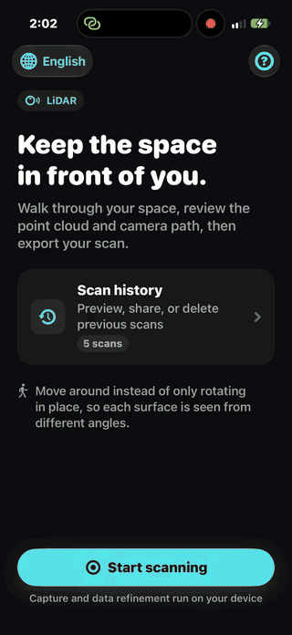

# ARKit 3DGS Scanner

**Scan with an iPhone, then train 3D Gaussian Splatting on the phone or export a dataset.**

**English** | [繁體中文](README.zh-TW.md)

<a href="docs/media/demo.mp4"></a>

*A 20-second loop at 8× speed. [Watch the 1-minute video](docs/media/demo.mp4) (2.7× speed): scan a desk, refine the data, and train a 3DGS model on the iPhone.*

Capture photos, camera poses, and point clouds with ARKit, refine them on the phone, then train a 3DGS model on the iPhone GPU or export a COLMAP dataset for a desktop trainer. Nothing is uploaded.

## Features

- **Capture with or without LiDAR.** Keyframes are chosen from movement and image quality. LiDAR depth is fused across views; camera-only scans keep verified sparse points and can add image-based depth. The app asks you to revisit covered ground in large spaces, to correct drift. See [capture](docs/CAPTURE_ARCHITECTURE.md) and [camera-only reconstruction](docs/CAMERA_ONLY_ACCURACY.md).
- **Refine on the phone.** Sharp-photo selection, camera pose refinement that applies only when a photo-alignment check improves, and multi-view depth fusion. See [pose refinement](docs/POSE_REFINEMENT.md) and [LiDAR surface consistency](docs/LIDAR_SURFACE_CONSENSUS.md).
- **Review before you train.** Inspect the point cloud, replay the capture route, continue the scan to fill gaps, and measure or calibrate metric scale. See [fusion review](docs/FUSION_REVIEW.md) and [metric scale](docs/LOOP_CLOSURE_AND_SCALE.md).
- **Train 3DGS on the iPhone.** A Metal trainer based on MRNF, with pose refinement, LiDAR depth seeds and loss, a live preview you can orbit, pause and resume, and a compact SOG model to share. See [on-device 3DGS training](docs/ON_DEVICE_3DGS.md).
- **Export a COLMAP dataset.** Original photos, `sparse/0`, depth, and poses in one ZIP. See [export](docs/HISTORY_TRAINING_EXPORT.md) and [external training](docs/TRAINING.md).
- **Scan history.** Every stopped scan is saved. You can preview, train, refine a copy, export, or delete it.
- **Traditional Chinese (default) and English**, switchable on the home screen.

```text
Scan → Refine → Review point cloud ─┬─ Train 3DGS on the iPhone → View / share the model
                  │                 └─ Export COLMAP ZIP → External 3DGS training
                  └─ Continue scanning to fill gaps
```

## Quick start

**Requirements:** Xcode 26+ and an iPhone or iPad with iOS 17+. On-device training needs an A14 chip or newer. LiDAR depth needs a LiDAR device. The Simulator can check the UI, not real AR scanning.

```sh
git clone https://github.com/KuoFengYuan/arkit-3dgs-scanner.git
open arkit-3dgs-scanner/arkit-3dgs-scanner.xcodeproj
```

1. In Xcode, select the `arkit-3dgs-scanner` scheme, your signing team, and a physical device, then Run.
2. Tap **Start scanning** and move around the scene so each surface is seen from several positions.
3. Stop, wait for processing, and check the point cloud. Continue scanning if something is missing.
4. Tap **Train 3DGS** to build a model on the phone, or **Export 3DGS dataset** to share a ZIP for a desktop trainer.

## Train 3DGS on the iPhone

| Quality | Iterations | Gaussian cap |
| --- | --- | --- |
| Quick preview | 4,000 | 300,000 |
| Standard (recommended) | 10,000 | 600,000 |
| High quality | 20,000 | 1,000,000 |

- **Resolution:** training images at 960 (default), 1,440, or the photos' full 1,920 px.
- **Iterations:** scans with many photos get more iterations. You can adjust the count before starting.
- **While it trains:** you can keep using the app. The run saves progress and pauses when the phone is too hot, the battery is low, memory runs short, or you switch apps. On iOS 26 it can continue in the background with the Background GPU Access capability.
- **Finish early** at any time, then **Enhance model** later to keep training it.
- **Share:** a `scan_…-3dgs.zip` with `gaussians.sog`, which SuperSplat, PlayCanvas, and LichtFeld Studio open directly.

Training speed, memory use, and heat on an iPhone have not been measured yet; Mac and Simulator results are not a substitute. See [on-device 3DGS training](docs/ON_DEVICE_3DGS.md) for usage, the method, measured results, and file formats.

## Development

Follow [CONTRIBUTING.md](CONTRIBUTING.md) and [AGENTS.md](AGENTS.md): task branches (`Feature/`, `Bugfix/`, `Enhance/`), a PR to `main`, and branch cleanup after the merge. The contribution guide lists the checks, the code layout, and the optional Python tools.

```sh
python3 tools/check_project.py
bash tools/test_localization.sh
```

## License

Copyright 2026 Kuo Feng-Yuan ([KuoFengYuan](https://github.com/KuoFengYuan)). Licensed under the [Apache License 2.0](LICENSE).

**This is a personal research project.** It is not a product of, and is not endorsed by, any employer or organisation, and it does not represent their views. It is provided as is, without warranty.

- **Commercial use is allowed**, including the on-device 3DGS trainer, and so are modification and redistribution.
- **Credit the author.** Any copy or derivative work must keep [LICENSE](LICENSE) and [NOTICE](NOTICE) and credit Kuo Feng-Yuan (KuoFengYuan) as the original author.
- The 3DGS trainer is an independent Swift and Metal implementation. It contains no code from the original 3D Gaussian Splatting (Inria/MPII) or Mip-Splatting releases, which allow only non-commercial use, and no code from LichtFeld Studio (GPL-3.0). [NOTICE](NOTICE) lists the papers and projects it follows.
- Third-party patents may still cover some of the methods. This is not legal advice; check before commercial use.

## Documentation

| Topic | Guides |
| --- | --- |
| Capture | [Capture architecture](docs/CAPTURE_ARCHITECTURE.md) · [Interface design](docs/INTERFACE_DESIGN.md) · [Live preview and quality gates](docs/LIDAR_QUALITY_AND_PREVIEW.md) · [Capture throughput](docs/CAPTURE_THROUGHPUT.md) · [Device operation](docs/DEVICE_NOTES.md) |
| Processing | [Fusion review](docs/FUSION_REVIEW.md) · [Pose refinement](docs/POSE_REFINEMENT.md) · [Loop closure and metric scale](docs/LOOP_CLOSURE_AND_SCALE.md) · [LiDAR surface consistency](docs/LIDAR_SURFACE_CONSENSUS.md) · [Camera-only reconstruction](docs/CAMERA_ONLY_ACCURACY.md) · [Surface reconstruction](docs/SURFACE_RECONSTRUCTION.md) · [Fusion diagnostics](docs/SCAN_FUSION_DIAGNOSTICS.md) · [Large-scan memory](docs/LARGE_SCAN_MEMORY.md) |
| 3DGS | [On-device training](docs/ON_DEVICE_3DGS.md) · [Training architecture](docs/ON_DEVICE_3DGS_ARCHITECTURE.md) · [Dataset refinement](docs/ON_DEVICE_TRAINING_QUALITY.md) · [External training](docs/TRAINING.md) |
| Data | [Export](docs/HISTORY_TRAINING_EXPORT.md) · [Coordinate conventions](docs/COORDINATES.md) · [Language support](docs/LOCALIZATION.md) |

Every guide has a Traditional Chinese version linked at its top. For a reproducible issue, include the device, capture mode, build configuration, processing report, and a small scan sample when you can.
