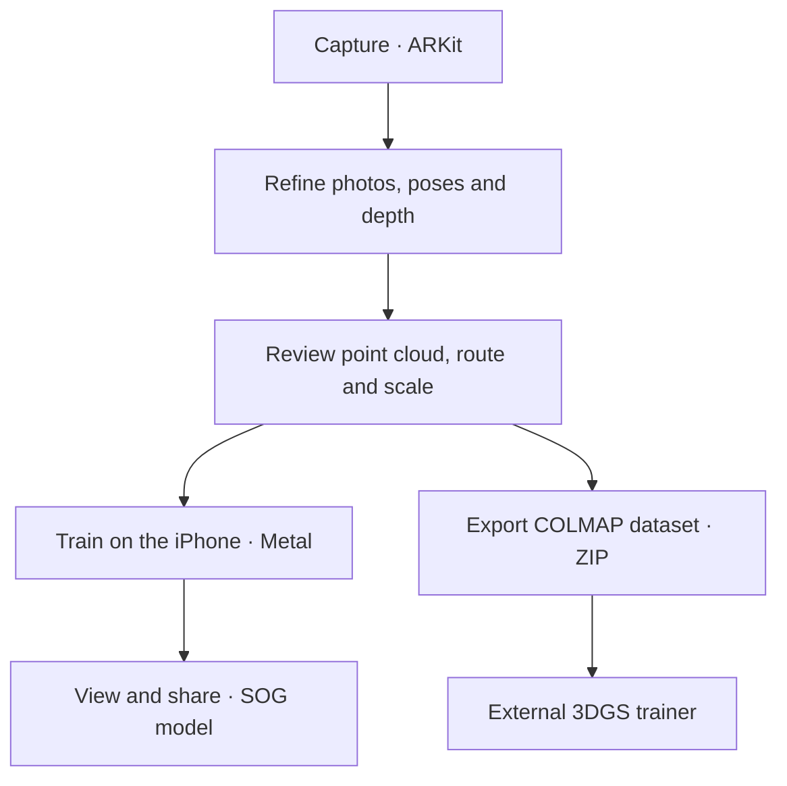

# ARKit 3DGS Scanner

**Scan with an iPhone, train 3D Gaussian Splatting on the phone, or export a dataset.**

**English** | [繁體中文](README.zh-TW.md)

[Quick start](#quick-start) · [Pipeline](#pipeline-and-features) · [Development](#development) · [Training](#train-3dgs-on-the-iphone) · [Benchmarks](#training-benchmarks) · [Guides](#documentation) · [License](#copyright-and-license)

**Personal research project · Noncommercial use only under [PolyForm Noncommercial 1.0.0](LICENSE).**

Capture photos, camera poses and point clouds with ARKit, refine the scan, then train a 3DGS model with Swift and Metal on the iPhone GPU. You can also export a COLMAP dataset for a desktop trainer. Capture, refinement and on-device training run locally; the app does not upload scans.

> [!IMPORTANT]
> **Measured training speed-up: 1.39× on iPhone 17 Pro and up to 1.45× on Mac (M1 Pro).** [See the combined speed and PSNR comparison](#training-benchmarks) on the author's F21171 scan.

<a href="docs/media/demo.mp4"></a>

*20-second demo loop at 8× speed. [Watch the 1-minute video](docs/media/demo.mp4) (2.7× speed): scan a desk, refine the data, and train a 3DGS model on the iPhone.*

## Quick start

| Requirement | Supported setup |
| --- | --- |
| Build | Xcode 26+ |
| Run | iPhone or iPad with iOS 17+; on-device training needs A14 or newer |
| Capture | LiDAR is optional; depth capture needs a LiDAR device |

Use a physical device for AR capture. The Simulator is for UI checks.

```sh
git clone https://github.com/KuoFengYuan/arkit-3dgs-scanner.git
cd arkit-3dgs-scanner
open arkit-3dgs-scanner.xcodeproj
```

1. Select the **arkit-3dgs-scanner** scheme, your signing team and a physical device, then Run. This scheme uses an optimised Release build.
2. Tap **Start scanning** and move so each surface is seen from several positions.
3. Stop, wait for processing and review the point cloud. Continue scanning to fill gaps.
4. Tap **Train 3DGS** to build a model on the phone, or **Export 3DGS dataset** to share a COLMAP ZIP for a desktop trainer.

## Pipeline and features


```mermaid
flowchart TB
    Capture["Capture · ARKit"] --> Refine["Refine photos, poses and depth"]
    Refine --> Review["Review point cloud, route and scale"]
    Review --> Train["Train on the iPhone · Metal"]
    Review --> Export["Export COLMAP dataset · ZIP"]
    Train --> Model["View and share · SOG model"]
    Export --> Desktop["External 3DGS trainer"]
```

| Stage | What the app does | Guide |
| --- | --- | --- |
| Capture | LiDAR or camera-only scanning, keyframes chosen by movement and image quality, and revisit guidance in large scenes | [Capture architecture](docs/CAPTURE_ARCHITECTURE.md) |
| Refine | Sharp-photo selection, camera corrections applied only when photo alignment improves, and multi-view depth fusion | [Pose refinement](docs/POSE_REFINEMENT.md) |
| Review | Point-cloud and photo/path playback, metric measurements, scale calibration, and continued scanning | [Fusion review](docs/FUSION_REVIEW.md) |
| Train | Swift/Metal 3DGS, a live preview you can orbit, pause/resume, saved checkpoints and SOG model sharing | [On-device training](docs/ON_DEVICE_3DGS.md) |
| Export | Original photos, `sparse/0`, depth and poses in a COLMAP ZIP | [Dataset export](docs/HISTORY_TRAINING_EXPORT.md) |

Every stopped scan is saved in **Scan history**, where you can preview, train, refine a copy, export or delete it. The app defaults to **Traditional Chinese**, with a persistent **English** option on the home screen.

## Development

### Where to start in the source

| Area | Responsibilities | Entry points |
| --- | --- | --- |
| Capture | AR session, keyframes, pose refinement, fusion and dataset export | [CaptureController.swift](arkit-3dgs-scanner/Capture/CaptureController.swift), [ExportManager.swift](arkit-3dgs-scanner/Capture/ExportManager.swift) |
| History | Scan storage, review, refinement and deletion | [ScanLibrary.swift](arkit-3dgs-scanner/History/ScanLibrary.swift) |
| Training | App lifecycle, run state, memory, checkpoints and training iterations | [TrainingCenter.swift](arkit-3dgs-scanner/Training/UI/TrainingCenter.swift), [GaussianTrainingSession.swift](arkit-3dgs-scanner/Training/GaussianTrainingSession.swift), [GaussianTrainer.swift](arkit-3dgs-scanner/Training/GaussianTrainer.swift) |
| Metal kernels | Projection, sorting, blending, loss and optimiser | [Training/](arkit-3dgs-scanner/Training/) (`GaussianRaster`, `GaussianSort`, `GaussianLoss`, `GaussianOptim`) |
| App UI | Home screen and shared visual components | [ContentView.swift](arkit-3dgs-scanner/ContentView.swift), [DesignSystem.swift](arkit-3dgs-scanner/Design/DesignSystem.swift) |
| Tools | Dataset conversion, replay, quality analysis and regression checks | [tools/](tools/), [train_gaussians.swift](tools/train_gaussians.swift) |

Read [capture architecture](docs/CAPTURE_ARCHITECTURE.md) or [training architecture](docs/ON_DEVICE_3DGS_ARCHITECTURE.md) alongside the source. The trainer is an independent Swift/Metal implementation based on MRNF, with pose refinement, LiDAR depth seeds/loss and per-image exposure/colour correction (PPISP). Capture and dataset preparation can be used independently of the trainer.

### Checks and contribution workflow

Run from the repository root:

```sh
python3 tools/check_project.py
bash tools/test_localization.sh
```

For trainer changes, also run `bash tools/test_gaussian_training.sh`; it runs the app's Metal kernels on the Mac GPU. It does not establish iPhone speed, memory use or heat. Use **arkit-3dgs-scanner-Debug** for source-level debugging; use the Release scheme for normal capture and training.

Follow [CONTRIBUTING.md](CONTRIBUTING.md) and [AGENTS.md](AGENTS.md): start an updated-main task branch (`Feature/`, `Bugfix/`, `Enhance/`), validate, open a PR, merge after required checks/reviews, then clean up the branch. The contribution guide includes device/Simulator build commands and optional Python tools. The asset catalog includes a 1024 × 1024 app icon for archived builds and TestFlight.

## Train 3DGS on the iPhone

| Quality | Base iterations | Gaussian cap |
| --- | --- | --- |
| Quick preview | 4,000 | 300,000 |
| Standard (recommended) | 10,000 | 600,000 |
| High quality | 20,000 | 1,000,000 |

- **Resolution:** 960 px by default, with 1,440 or full 1,920 px options.
- **Iterations:** scans with many photos automatically get more; you can adjust the count before starting. The memory plan may lower the Gaussian cap.
- **Pause and resume:** progress is saved when the phone is too hot, the battery is low, memory runs short or the app leaves the foreground. Supported iOS 26+ devices can continue in the background with Background GPU Access and an OS-granted task.
- **Finish and share:** finish early, enhance a saved model later, or share a `scan_…-3dgs.zip` containing `gaussians.sog`. SuperSplat, PlayCanvas and LichtFeld Studio can open it.

For setup, live previews, background requirements and model files, see [on-device 3DGS training](docs/ON_DEVICE_3DGS.md).

## Training benchmarks

**Dataset source:** F21171 is a room-and-bathroom scan captured by the project author. The table reports measured training results on the author's own scan.

Same workload before and after the speed optimisation: **10,000 iterations, 960 px, PPISP on and a 600,000 Gaussian cap**. PSNR measures similarity to held-out photos after test-time pose alignment; **higher is better**.

| Device / metric | Training time: before → after | Speed-up | PSNR: before → after | PSNR change |
| --- | --- | --- | --- | --- |
| Mac, M1 Pro: aligned PSNR | 374.2 / 386.7 → **261.7 / 277.6 s** | **1.37–1.45×** | 23.861 → **23.859 dB** | −0.002 dB |
| Mac, M1 Pro: colour-aligned PSNR at 1,920 px | Same Mac runs | Same speed-up | 25.329 → **25.354 dB** | +0.025 dB |
| iPhone 17 Pro: aligned PSNR | 769.4 → **553.1 s** | **1.39×** | 23.946 → **23.907 dB** | −0.039 dB |

The aligned PSNR differences are within the baseline's measured Mac rerun spread of up to 0.10 dB. The colour-aligned metric also removes overall brightness and colour differences before scoring.

<details>
<summary>Measurement setup and limits</summary>

- **Dataset split:** 715 training photos and the same 143 held-out photos. The training method and settings are unchanged across the speed comparison.
- **Mac:** PSNR is the mean of two runs per version. Speed-up uses the mean time before the change; Xcode builds ran during the second after run.
- **Phone:** one run per version, both at `serious` thermal state. Compared with another before run that started cooler (658.0 s), the speed-up is 1.19×.
- **Quality:** the Mac's empty-pixel share rose by 0.4 percentage points on average. With two runs each, that difference is unresolved.
- **Scope:** the iPhone 17 Pro used an iOS 27.0 Release benchmark build that calls the trainer directly, without live previews. Other iPhones, High quality, full-resolution training and the normal training screen were not measured. Mac and Simulator results do not establish iPhone performance.

[Full speed and quality results](docs/ON_DEVICE_3DGS.md#faster-training-steps-on-a-large-scan) · [Reproduce the device benchmark](docs/DEVICE_NOTES.md#training-speed-benchmark)

</details>

## Documentation

| What you want to understand | Start here |
| --- | --- |
| AR capture and processing flow | [Capture architecture](docs/CAPTURE_ARCHITECTURE.md) |
| Trainer ownership and GPU data flow | [Training architecture](docs/ON_DEVICE_3DGS_ARCHITECTURE.md) |
| Training methods, settings and experiments | [On-device 3DGS training](docs/ON_DEVICE_3DGS.md) |
| Dataset files and coordinate conventions | [Dataset export](docs/HISTORY_TRAINING_EXPORT.md), [Coordinates](docs/COORDINATES.md) |
| Training on a desktop | [External training](docs/TRAINING.md) |
| Adding translated UI text | [Localization](docs/LOCALIZATION.md) |

<details>
<summary>All guides by topic</summary>

| Topic | Guides |
| --- | --- |
| Capture | [Capture architecture](docs/CAPTURE_ARCHITECTURE.md) · [Interface design](docs/INTERFACE_DESIGN.md) · [Live preview and quality gates](docs/LIDAR_QUALITY_AND_PREVIEW.md) · [Capture throughput](docs/CAPTURE_THROUGHPUT.md) · [Device operation](docs/DEVICE_NOTES.md) |
| Processing | [Fusion review](docs/FUSION_REVIEW.md) · [Pose refinement](docs/POSE_REFINEMENT.md) · [Loop closure and metric scale](docs/LOOP_CLOSURE_AND_SCALE.md) · [LiDAR surface consistency](docs/LIDAR_SURFACE_CONSENSUS.md) · [Camera-only reconstruction](docs/CAMERA_ONLY_ACCURACY.md) · [Surface reconstruction](docs/SURFACE_RECONSTRUCTION.md) · [Fusion diagnostics](docs/SCAN_FUSION_DIAGNOSTICS.md) · [Large-scan memory](docs/LARGE_SCAN_MEMORY.md) |
| 3DGS | [On-device training](docs/ON_DEVICE_3DGS.md) · [Training architecture](docs/ON_DEVICE_3DGS_ARCHITECTURE.md) · [Dataset refinement](docs/ON_DEVICE_TRAINING_QUALITY.md) · [External training](docs/TRAINING.md) |
| Data | [Export](docs/HISTORY_TRAINING_EXPORT.md) · [Coordinate conventions](docs/COORDINATES.md) · [Language support](docs/LOCALIZATION.md) |

Every guide has a Traditional Chinese version linked at its top. For a reproducible issue, include the device, capture mode, build configuration, processing report, and a small scan sample when you can.

</details>

## Copyright and license

Copyright © 2026 Kuo Feng-Yuan ([KuoFengYuan](https://github.com/KuoFengYuan)). Licensed under the [PolyForm Noncommercial License 1.0.0](LICENSE); all rights not granted by that licence are reserved.

**This is a personal research project.** It is not a product of, and is not endorsed by, any employer or organisation, and it does not represent their views. It is provided as is, without warranty.

- **Noncommercial use only under this licence**, including the on-device 3DGS trainer. Use, modification and redistribution are permitted for the purposes defined in [LICENSE](LICENSE), including noncommercial research and personal study. Commercial use is outside this grant.
- **Credit the author.** Redistribution must provide the licence terms or their URL and the `Required Notice:` attribution in [NOTICE](NOTICE). Keeping [LICENSE](LICENSE) and [NOTICE](NOTICE) with copies and derivative works supplies both.
- **What the copyright covers:** the source code, the documentation and the demo recording in `docs/media`, all the author's own work. Every source file starts with an `SPDX-License-Identifier: PolyForm-Noncommercial-1.0.0` header.
- **App icon:** made with an AI image generator at the author's direction. Copyright may not protect such images in every jurisdiction; to the extent the author holds rights in it, it is licensed on the same terms.
- The 3DGS trainer is an independent Swift and Metal implementation. It contains no code from the original 3D Gaussian Splatting (Inria/MPII) or Mip-Splatting releases, which allow only non-commercial use, and no code from LichtFeld Studio (GPL-3.0). [NOTICE](NOTICE) lists the papers and projects it follows.
- **File formats:** the COLMAP export and the SOG model file follow the formats as COLMAP and PlayCanvas document them. No code from either project is included; the readers and writers are this project's own.
- **Third-party software:** the app uses only Apple's system frameworks. The Python tools need packages installed separately (`tools/requirements.txt`), each under its own licence; none is included in this repository.
- **Trademarks:** Apple, iPhone, ARKit and Metal are trademarks of Apple Inc. Other product and project names belong to their owners and are used only to describe compatibility; no endorsement is implied.
- Third-party patents may still cover some of the methods. This licence does not grant rights to third-party patents.

**Earlier releases:** material published under Apache 2.0 through commit `d5d8e31` keeps its original permissions, including commercial use. This change does not revoke those grants. See [licensing scope and history](docs/LICENSING.md) and the [historical Apache 2.0 text](licenses/Apache-2.0.txt).

The sources were compared with the reference implementations; see [provenance](docs/ON_DEVICE_3DGS.md#provenance-and-licences).
