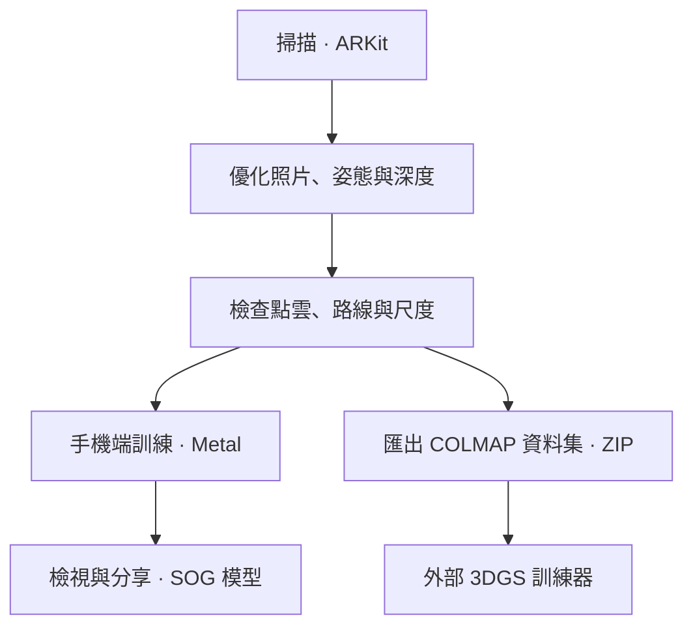

# ARKit 3DGS Scanner

**用 iPhone 掃描，直接在手機上訓練 3D Gaussian Splatting，或匯出資料集。**

[English](README.md) | **繁體中文**

[快速開始](#快速開始) · [流程](#流程與功能) · [開發入口](#開發入口) · [訓練設定](#在-iphone-上訓練-3dgs) · [實測比較](#訓練實測) · [文件](#文件導覽) · [授權](#版權與授權)

**個人研究專案 · [PolyForm Noncommercial 1.0.0](LICENSE) 僅允許非商業用途。**

以 ARKit 擷取照片、相機姿態與點雲，優化掃描資料，再用 Swift 與 Metal 在 iPhone GPU 上訓練 3DGS 模型，也可以匯出 COLMAP 資料集給電腦上的訓練器。採集、優化與手機端訓練均在裝置上執行，App 不會上傳掃描資料。

> [!IMPORTANT]
> **實測訓練加速：iPhone 17 Pro 快 1.39 倍，Mac（M1 Pro）最高快 1.45 倍。** [查看速度與 PSNR 的統整比較](#訓練實測)，使用作者自行拍攝的 F21171 資料。

<a href="docs/media/demo.mp4"></a>

*20 秒示範循環，8 倍速。[觀看 1 分鐘影片](docs/media/demo.mp4)（2.7 倍速）：掃描桌面、優化資料，並在 iPhone 上訓練 3DGS 模型。*

## 快速開始

| 需求 | 支援條件 |
| --- | --- |
| 編譯 | Xcode 26 以上 |
| 執行 | iOS 17 以上的 iPhone 或 iPad；手機端訓練需要 A14 或更新晶片 |
| 掃描 | LiDAR 為可選；深度擷取需要有 LiDAR 的裝置 |

AR 掃描需要實體裝置；Simulator 用於介面檢查。

```sh
git clone https://github.com/KuoFengYuan/arkit-3dgs-scanner.git
cd arkit-3dgs-scanner
open arkit-3dgs-scanner.xcodeproj
```

1. 選擇 **arkit-3dgs-scanner** scheme、自己的簽章 Team 與實體裝置，再執行。這個 scheme 使用優化過的 Release 版本。
2. 按「開始掃描」，讓每個表面都從幾個不同位置被拍到。
3. 停止後等待處理，檢查點雲；有缺漏就續掃補拍。
4. 按「訓練 3DGS」在手機上建立模型，或按「匯出 3DGS 訓練資料」分享 COLMAP ZIP 給電腦上的訓練器。

## 流程與功能



| 階段 | App 的工作 | 文件 |
| --- | --- | --- |
| 掃描 | LiDAR 或純相機掃描，依移動與畫質選關鍵影格，大場景提供回訪提示 | [掃描架構](docs/CAPTURE_ARCHITECTURE.zh-TW.md) |
| 優化 | 選清晰照片，只有照片對齊改善才套用姿態修正，多視角深度融合 | [姿態精修](docs/POSE_REFINEMENT.zh-TW.md) |
| 檢查 | 點雲與照片／路線回放、公尺量測、尺度校正與續掃補拍 | [融合預覽](docs/FUSION_REVIEW.zh-TW.md) |
| 訓練 | Swift／Metal 3DGS，可旋轉的即時預覽、暫停續訓、檢查點與 SOG 模型分享 | [手機端訓練](docs/ON_DEVICE_3DGS.zh-TW.md) |
| 匯出 | 原始照片、`sparse/0`、深度與姿態打包成 COLMAP ZIP | [資料集匯出](docs/HISTORY_TRAINING_EXPORT.zh-TW.md) |

停止後的掃描會存入「**掃描紀錄**」，可預覽、訓練、另存優化版本、匯出或刪除。App 預設為**繁體中文**，首頁可切換**英文**並保存偏好。

## 開發入口

### 從哪些程式開始讀

| 區域 | 職責 | 程式入口 |
| --- | --- | --- |
| 掃描 | AR session、關鍵影格、姿態精修、融合與資料集匯出 | [CaptureController.swift](arkit-3dgs-scanner/Capture/CaptureController.swift)、[ExportManager.swift](arkit-3dgs-scanner/Capture/ExportManager.swift) |
| 紀錄 | 掃描儲存、預覽、優化與刪除 | [ScanLibrary.swift](arkit-3dgs-scanner/History/ScanLibrary.swift) |
| 訓練 | App 生命週期、執行狀態、記憶體、檢查點與訓練迭代 | [TrainingCenter.swift](arkit-3dgs-scanner/Training/UI/TrainingCenter.swift)、[GaussianTrainingSession.swift](arkit-3dgs-scanner/Training/GaussianTrainingSession.swift)、[GaussianTrainer.swift](arkit-3dgs-scanner/Training/GaussianTrainer.swift) |
| Metal 核心 | 投影、排序、混合、損失與最佳化器 | [Training/](arkit-3dgs-scanner/Training/)（`GaussianRaster`、`GaussianSort`、`GaussianLoss`、`GaussianOptim`） |
| App 介面 | 首頁與共用視覺元件 | [ContentView.swift](arkit-3dgs-scanner/ContentView.swift)、[DesignSystem.swift](arkit-3dgs-scanner/Design/DesignSystem.swift) |
| 工具 | 資料轉換、重播、品質分析與回歸檢查 | [tools/](tools/)、[train_gaussians.swift](tools/train_gaussians.swift) |

閱讀程式時可搭配[掃描架構](docs/CAPTURE_ARCHITECTURE.zh-TW.md)或[訓練架構](docs/ON_DEVICE_3DGS_ARCHITECTURE.zh-TW.md)。訓練器是以 MRNF 為基礎的獨立 Swift／Metal 實作，加入姿態精修、LiDAR 深度種子／損失與逐張照片的曝光／色彩補償（PPISP）。掃描與資料準備也可獨立於訓練器使用。

### 檢查與貢獻流程

在 repository 根目錄執行：

```sh
python3 tools/check_project.py
bash tools/test_localization.sh
```

修改訓練器時，另執行 `bash tools/test_gaussian_training.sh`，以 Mac GPU 跑 App 的 Metal 核心；這不能證明 iPhone 的速度、記憶體或發熱。逐步除錯使用 **arkit-3dgs-scanner-Debug**；正常掃描與訓練使用 Release scheme。

遵循[貢獻流程](CONTRIBUTING.zh-TW.md)與[工作規範](AGENTS.zh-TW.md)：從更新的 `main` 建立任務分支（`Feature/`、`Bugfix/`、`Enhance/`），驗證、開 PR，必要檢查／審核通過後合併並清理分支。貢獻流程包含裝置／Simulator 建置指令與可選的 Python 工具。素材目錄已有 1024 × 1024 的 App 圖示，可用於封存版本與 TestFlight。

## 在 iPhone 上訓練 3DGS

| 品質 | 基本迭代次數 | Gaussian 上限 |
| --- | --- | --- |
| 快速預覽 | 4,000 | 300,000 |
| 標準（建議） | 10,000 | 600,000 |
| 高品質 | 20,000 | 1,000,000 |

- **解析度：** 預設 960 px，可選 1,440 或原始 1,920 px。
- **迭代次數：** 照片較多時自動增加，開始前可自行調整；記憶體配置可能降低高斯上限。
- **暫停續訓：** 手機過熱、電量不足、記憶體吃緊或離開前景時先存檔。支援的 iOS 26 以上裝置，在具備 Background GPU Access 且取得系統核准的背景任務後可繼續訓練。
- **完成與分享：** 可提前完成、之後加強已存模型，或分享包含 `gaussians.sog` 的 `scan_…-3dgs.zip`。SuperSplat、PlayCanvas 與 LichtFeld Studio 可開啟。

設定、即時預覽、背景執行條件與模型檔案詳見[手機端 3DGS 訓練](docs/ON_DEVICE_3DGS.zh-TW.md)。

## 訓練實測

**資料來源：** F21171 為專案作者自行拍攝的房間與浴室掃描資料，表格數據來自這組資料的訓練實測。

速度優化前後使用相同工作量：**10,000 次迭代、960 px、開啟 PPISP、高斯上限 600,000**。PSNR 比較模型與保留照片在測試時姿態對齊後的相似程度，**越高越好**。

| 裝置／指標 | 訓練時間：優化前 → 後 | 加速倍數 | PSNR：優化前 → 後 | PSNR 差異 |
| --- | --- | --- | --- | --- |
| Mac，M1 Pro：對齊後 PSNR | 374.2／386.7 → **261.7／277.6 s** | **1.37–1.45 倍** | 23.861 → **23.859 dB** | −0.002 dB |
| Mac，M1 Pro：1,920 px 排除色差後 PSNR | 同一組 Mac 測試 | 同上 | 25.329 → **25.354 dB** | +0.025 dB |
| iPhone 17 Pro：對齊後 PSNR | 769.4 → **553.1 s** | **1.39 倍** | 23.946 → **23.907 dB** | −0.039 dB |

對齊後 PSNR 的差異落在 Mac 基準重跑最高約 0.10 dB 的波動範圍內；排除色差的指標另會先校正整體亮度與色彩差異。

<details>
<summary>量測方式與限制</summary>

- **資料切分：** 715 張訓練照片與同一批 143 張保留照片；速度比較前後的訓練方法與設定相同。
- **Mac：** PSNR 為每個版本兩次執行的平均。加速倍數以優化前的平均時間計算；優化後第 2 次同時在編譯 Xcode 專案。
- **手機：** 每個版本一次，前後均為 `serious` 散熱狀態。若改與起始較涼的另一次優化前測試（658.0 s）比較，則快 1.19 倍。
- **品質：** Mac 的空像素比例平均增加 0.4 個百分點，前後各只有兩次，尚無法判定差異。
- **範圍：** iPhone 17 Pro 使用 iOS 27.0 的 Release 基準測試版本，直接呼叫訓練器，不含即時預覽。其他 iPhone、高品質、全解析度訓練與一般訓練畫面尚未量測。Mac 與 Simulator 結果不能推定 iPhone 效能。

[完整速度與品質結果](docs/ON_DEVICE_3DGS.zh-TW.md#加快大型掃描的訓練步驟) · [重現實機基準測試](docs/DEVICE_NOTES.zh-TW.md#訓練速度基準測試)

</details>

## 文件導覽

| 想了解的內容 | 建議先讀 |
| --- | --- |
| AR 掃描與處理流程 | [掃描架構](docs/CAPTURE_ARCHITECTURE.zh-TW.md) |
| 訓練器執行權責與 GPU 資料流 | [訓練架構](docs/ON_DEVICE_3DGS_ARCHITECTURE.zh-TW.md) |
| 訓練方法、設定與實驗 | [手機端 3DGS 訓練](docs/ON_DEVICE_3DGS.zh-TW.md) |
| 資料集檔案與座標慣例 | [資料集匯出](docs/HISTORY_TRAINING_EXPORT.zh-TW.md)、[座標慣例](docs/COORDINATES.zh-TW.md) |
| 電腦端訓練 | [外部訓練](docs/TRAINING.zh-TW.md) |
| 新增介面翻譯 | [語系說明](docs/LOCALIZATION.zh-TW.md) |

<details>
<summary>依主題查看所有文件</summary>

| 主題 | 文件 |
| --- | --- |
| 掃描 | [掃描架構](docs/CAPTURE_ARCHITECTURE.zh-TW.md) · [介面設計](docs/INTERFACE_DESIGN.zh-TW.md) · [即時預覽與品質閘門](docs/LIDAR_QUALITY_AND_PREVIEW.zh-TW.md) · [拍攝吞吐量](docs/CAPTURE_THROUGHPUT.zh-TW.md) · [裝置操作](docs/DEVICE_NOTES.zh-TW.md) |
| 處理 | [融合進度與預覽](docs/FUSION_REVIEW.zh-TW.md) · [姿態精修](docs/POSE_REFINEMENT.zh-TW.md) · [閉環修正與公尺尺度](docs/LOOP_CLOSURE_AND_SCALE.zh-TW.md) · [LiDAR 多視角共識](docs/LIDAR_SURFACE_CONSENSUS.zh-TW.md) · [無 LiDAR 重建](docs/CAMERA_ONLY_ACCURACY.zh-TW.md) · [表面重建](docs/SURFACE_RECONSTRUCTION.zh-TW.md) · [融合診斷](docs/SCAN_FUSION_DIAGNOSTICS.zh-TW.md) · [大場景記憶體](docs/LARGE_SCAN_MEMORY.zh-TW.md) |
| 3DGS | [手機端訓練](docs/ON_DEVICE_3DGS.zh-TW.md) · [訓練架構](docs/ON_DEVICE_3DGS_ARCHITECTURE.zh-TW.md) · [手機端資料優化](docs/ON_DEVICE_TRAINING_QUALITY.zh-TW.md) · [外部訓練](docs/TRAINING.zh-TW.md) |
| 資料 | [匯出](docs/HISTORY_TRAINING_EXPORT.zh-TW.md) · [座標慣例](docs/COORDINATES.zh-TW.md) · [語系說明](docs/LOCALIZATION.zh-TW.md) |

每份文件開頭都有英文版連結。回報可重現的問題時，請附上裝置、掃描模式、建置設定、處理報告，可以的話再附一小份掃描樣本。

</details>

## 版權與授權

Copyright © 2026 Kuo Feng-Yuan（[KuoFengYuan](https://github.com/KuoFengYuan)）。本專案採用 [PolyForm Noncommercial License 1.0.0](LICENSE)；該授權未授予的權利均予保留。

**本專案為個人研究專案**，並非任何雇主或機構的產品，未經其背書，也不代表其立場。本專案依現狀提供，不附任何擔保。

- **本授權僅允許非商業用途**，包含手機端 3DGS 訓練器。可依 [LICENSE](LICENSE) 定義的允許用途使用、修改與再散布，包含非商業研究及個人學習；商業用途不在本授權範圍內。
- **先前版本**：截至 commit [`d5d8e31`](https://github.com/KuoFengYuan/arkit-3dgs-scanner/tree/apache-2.0-final)（tag `apache-2.0-final`）以 Apache 2.0 發布的內容，包含其 fork 與 clone，仍保有原本的 Apache 2.0 權利。該 commit 之後的變更僅依 PolyForm Noncommercial 1.0.0 授權。詳見[授權範圍](docs/LICENSING.zh-TW.md)。
- **必須標註作者**：再散布時須提供授權條款或其網址，以及 [NOTICE](NOTICE) 中以 `Required Notice:` 開頭的作者署名。將 [LICENSE](LICENSE) 與 [NOTICE](NOTICE) 隨複製或衍生作品一同保留，即可提供兩者。
- **版權涵蓋範圍**：原始碼、文件，以及 `docs/media` 中的示範錄影，均為作者本人的作品。每個原始碼檔開頭都有 `SPDX-License-Identifier: PolyForm-Noncommercial-1.0.0` 檔頭。
- **App 圖示**：由作者指示 AI 影像生成工具製作。這類影像在部分法域可能不受著作權保護；在作者享有權利的範圍內，以相同條款授權。
- 3DGS 訓練器是以 Swift 與 Metal 獨立實作。其中不含原版 3D Gaussian Splatting（Inria／MPII）與 Mip-Splatting 的程式碼，這兩者只允許非商用；也不含 LichtFeld Studio（GPL-3.0）的程式碼。參考的論文與專案列在 [NOTICE](NOTICE)。
- **檔案格式**：COLMAP 匯出與 SOG 模型檔依照 COLMAP 與 PlayCanvas 文件所定義的格式。兩者的程式碼都未包含在內，讀寫程式是本專案自行撰寫。
- **第三方軟體**：App 只使用 Apple 的系統框架。Python 工具需要另外安裝的套件（`tools/requirements.txt`），各自依其授權；本 repo 未包含任何第三方套件。
- **商標**：Apple、iPhone、ARKit 與 Metal 是 Apple Inc. 的商標。其他產品與專案名稱屬於各自的所有者，僅用於說明相容性，不代表任何背書。
- 部分方法仍可能涉及第三方專利；本授權未授予第三方專利的權利。

原始碼已與參考實作比對過，見[來源與授權](docs/ON_DEVICE_3DGS.zh-TW.md#來源與授權)。
