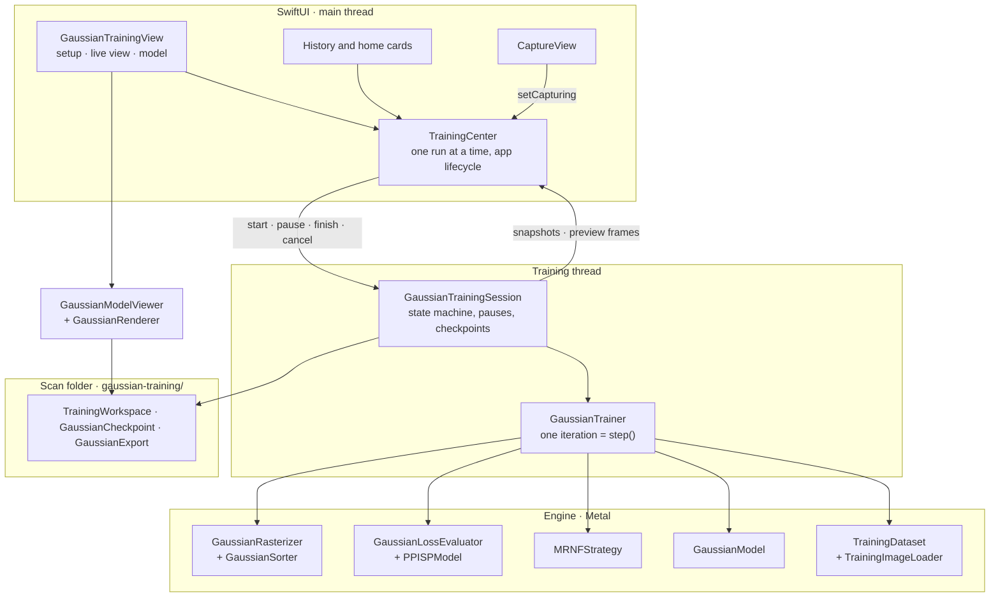
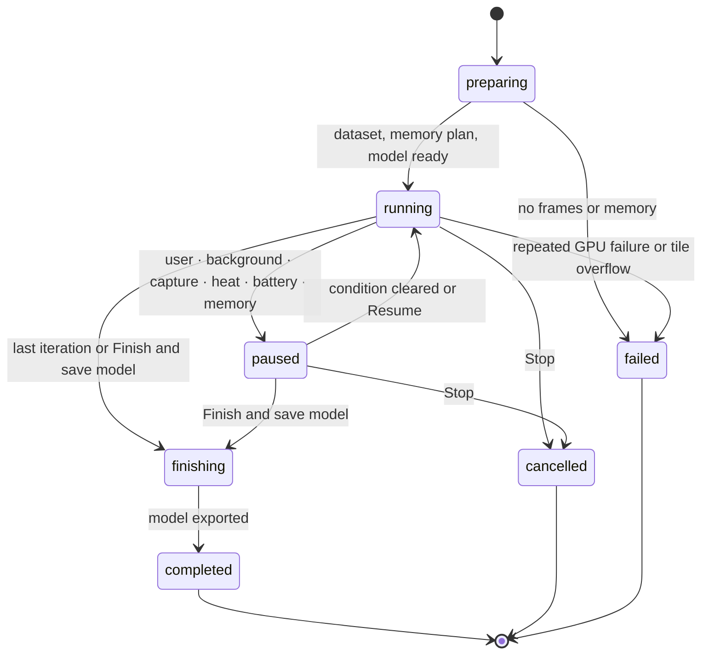

# On-device 3DGS training architecture

**English** | [繁體中文](ON_DEVICE_3DGS_ARCHITECTURE.zh-TW.md)

This page describes how the on-device 3D Gaussian Splatting trainer is built: its layers, threads, per-iteration GPU pipeline, data layout, memory plan, files, and tests. For how to use it, the training method, and measured results, see [on-device 3DGS training](ON_DEVICE_3DGS.md).

Everything lives in `arkit-3dgs-scanner/Training/`. It is Swift and Metal only, with no server and no third-party code (see [provenance](ON_DEVICE_3DGS.md#provenance-and-licences)).

## Layers

| File | Responsibility |
| --- | --- |
| `GaussianTrainer.swift` | `GaussianTrainingConfiguration` (presets, resolution tiers, enhancement), `PoseCorrection`, and `GaussianTrainer`: initialisation (seeds, a checkpoint, or a saved model), `step()`, evaluation, previews |
| `GaussianTrainingSession.swift` | The run's state machine on its own thread: controls, automatic pauses, checkpoints, live-view requests, finishing and model export |
| `GaussianModel.swift` | Fixed-capacity parameter, gradient, Adam and statistics buffers; free-row reuse |
| `GaussianRasterizer.swift`, `GaussianSorter.swift` | Camera and buffer layouts, projection, tile binning, forward blend and backward pass; GPU scans and radix sorts |
| `GaussianLoss.swift`, `PPISP.swift` | L1 + D-SSIM loss with the MRNF error map; the PPISP colour model (CPU parameters, GPU per-pixel work) |
| `MRNFStrategy.swift` | Schedule, learning rates, scene bounds and densification (prune, replace, grow, hole seeds) |
| `TrainingDataset.swift` | Frame selection, hold-out, seed cloud and LiDAR depth seeds, cameras, LiDAR depth targets, streamed image decoding |
| `TrainingMemoryPlan.swift` | The overflow-checked memory plan and automatic budget |
| `GaussianCheckpoint.swift` | The resumable `checkpoint.gsck` format |
| `GaussianExport.swift` | The saved model file (SOG, or PLY from before SOG), PLY write and read, metadata, `ppisp.json`, the COLMAP frame conversion |
| `GaussianSOG.swift`, `WebPLossless.swift`, `StoredZip.swift` | The SOG model file: Morton order, quantisation and codebooks, the GPU k-means of the SH palette; a lossless WebP (VP8L) encoder; stored ZIP archives |
| `TrainingWorkspace.swift` | `state.json` (`TrainingRecord`), the folder layout, discard and delete rules, the share archive |
| `GaussianRenderer.swift`, `GaussianModelViewer.swift` | Preview and saved-model rendering with an orbit camera |
| `GaussianMetal.swift` | Device, pipelines, buffers, and a compact dispatch helper |
| `*.metal` | Kernels: `GaussianRaster`, `GaussianSort`, `GaussianLoss`, `GaussianOptim`, `GaussianSOG` (palette assignment) |
| `UI/TrainingCenter.swift` | App-wide owner of the run: lifecycle and memory observers, battery, idle timer, background continuation |
| `UI/GaussianTrainingView.swift`, `UI/GaussianViewport.swift`, `UI/TrainingPresentation.swift` | The training screen, the gesture viewport, and shared wording, cards and speed history |

## Threads and ownership

- **Main thread:**
  - `TrainingCenter` is a `@MainActor` singleton; it starts at most one run and republishes its snapshots for SwiftUI.
  - It observes app activity and memory pressure (a `DispatchSource`), watches the battery, and keeps the screen awake while training.
  - On iOS 26 it owns the `BGContinuedProcessingTask`.
- **Training thread:**
  - A dedicated `Thread` (user-initiated QoS, 4 MB stack) runs `GaussianTrainingSession.run()`.
  - `GaussianTrainer` is used only from this thread.
  - Controls (pause, resume, checkpoint, finish, cancel, background, capture, memory) are flags behind one `NSCondition`; the loop reads them between iterations.
  - Snapshots go to the main queue at most four times a second.
  - Previews render on this thread between iterations: every 1.5 s, or every 0.08 s while the user moves the camera.
- **Image decoding:** `TrainingImageLoader` decodes the scan's JPEGs to RGBA8 at the training resolution on a serial queue. It prefetches the next view into a cache of three images, and writes nothing to disk.
- **Saved-model viewer:** `GaussianModelViewer` renders on its own queue, and only the latest camera request is kept.
- **GPU:**
  - One command queue. Each stage is its own command buffer that the thread waits for, so small results (the intersection count, loss sums, the pose gradient) can be read between stages.
  - Long passes are split so no command buffer runs long enough for the GPU watchdog to abort it (see [the iteration](#one-iteration)).

## A run from start to finish

1. **Prepare (`execute`):**
   - `TrainingDataset.prepare` selects frames, marks hold-out views, loads the seed cloud (`review.ply`, else `points.ply`), and adds LiDAR depth seeds.
   - `TrainingMemoryPlan.fit` sizes every buffer. A resume must fit the checkpoint's rows, and an enhancement the saved model's Gaussians; otherwise the run stops with the memory it needs.
2. **Initialise:** one of three ways.
   - A new run seeds from the point cloud.
   - A resume loads `checkpoint.gsck`.
   - **Enhance model** loads `model/` with `initializeModel(fromSaved:)`: the SOG (or older PLY) model back in the ARKit frame, the refined poses turned back into corrections by frame id, and `ppisp.json`. It then continues the schedule from the saved iteration.
3. **Loop:**
   - Before each iteration: controls, memory, heat and battery.
   - `trainer.step()`.
   - A checkpoint at every pause, when the app leaves the foreground, and when stopping with the progress kept; nothing periodic.
4. **Finish:**
   - Evaluate the hold-out views.
   - Write the model folder into a staging directory and swap it in atomically.
   - Remove the checkpoint and save the completed record.
   - A new run or enhancement replaces the saved model only here. Stopping one with *delete* restores the saved model's record.
5. **Failures:**
   - A GPU failure before the parameter update skips the view.
   - Three in a row raise an error: the session reloads the last checkpoint, and repeated failures in the foreground stop the run.
   - In the background, losing the GPU pauses the run instead.

## One iteration

`GaussianTrainer.step()` trains on one view from a shuffled epoch order. Each numbered stage is one command buffer; the backward pass is one per band.

| Stage | Where | Work (kernels) |
| --- | --- | --- |
| Refine | CPU | Every `refineEvery` iterations while refining: `MRNFStrategy.refine` edits rows in the shared buffers (prune, replace, grow up to the growth-ramp ceiling, hole seeds, bounds, and the optional relocation). The GPU is idle meanwhile |
| 1. Project | GPU | Fold the last backward pass into the statistics and add position noise (`mrnf_fold`, `mrnf_noise`). Build the photo's edge map (`edge_blur`, `edge_sobel_nms`). Project every Gaussian: EWA covariance, SH colour, Mip filter, optional capture motion, and the number of tiles its ellipse actually reaches, row by row (`project_forward`). Sort by depth (`iota_uint`, 32-bit radix). Scan tile counts (`gather_uint`, `scan_block`, `scan_add`). Record screen share (`screen_share`) |
| Read back | CPU | Intersection count. Over capacity: skip the view and stop growth |
| 2. Forward | GPU | Normalise the edge map (`scale_float`). Emit (tile, Gaussian) pairs for the tiles each ellipse reaches (`emit_intersections`, `tileRowSpan`). Stable 16-bit tile sort (depth order is kept). Find tile ranges (`tile_ranges`). Blend front to back in 16 × 16 tiles, with depth (`rasterize_forward`). Then the loss in the same command buffer: optional PPISP (`ppisp_forward`), 0.8 · L1 + 0.2 · D-SSIM (`ssim_forward`, `ssim_backward`), gradients back through PPISP (`ppisp_backward`), and the MRNF error map. The CPU prepares the view's LiDAR target meanwhile |
| 3. Backward | GPU | Replay each tile in reverse in bands of at most 2,048 tiles, one command buffer each; the first also clears the gradients. Two bands at 960 × 720, six at 1,920 × 1,440 (`rasterize_backward`, with the LiDAR depth loss). Each SIMD group sums its 32 pixels' 13 values per Gaussian with 16 shuffles (`simdSum16`) and adds them with device atomics. Then screen-space to 3D parameter and camera-pose gradients (`project_backward`), and while refining the relocation statistics of this view (`relocation_fold`), before a preview render can replace its tile counts |
| 4. Adam | GPU | `adam_step` for the six parameter groups, with the MRNF opacity regulariser, the refining scale mode and the screen-share penalty |
| Update | CPU | PPISP gradient and Adam (9 parameters per frame, 27 per camera). The view's pose correction Adam step, once pose refinement has started |

Growth, SH degree, learning rates, pose refinement and PPISP warm-up all follow `MRNFSchedule`, which scales LichtFeld Studio's 30,000-iteration timings to the run length.

## Data layout

**`GaussianModel`:**
- Structure of arrays in one buffer per role (`params`, `grads`, `adamM`, `adamV`), all with the same layout:

  | Group | Floats | Stored as |
  | --- | --- | --- |
  | means | 3 | metres, ARKit world |
  | scales | 3 | log |
  | quats | 4 | wxyz, normalised in the kernels |
  | opacities | 1 | logit |
  | sh0 | 3 | DC |
  | shN | 3 · ((d + 1)² − 1) | higher bands, 45 at degree 3 |

  That is 59 floats per Gaussian at SH degree 3.
- `stats` holds nine per-row planes: visibility, error maximum, edge sum, share maximum, current share, active, and for relocation the views that reached the row, the error sum and the count of consecutive low-contribution windows. All but the last restart at every refine.
- **Capacity:** fixed from the memory plan. Pruned rows get a zero quaternion, which the rasterizer culls, and are refilled before the model grows, so densification never allocates.

**Rasterizer:**
- **Per Gaussian:** projected centres, conics, colours, tile counts, rectangles, depth keys, sort order, and `grad2d`. `grad2d` has 13 floats: dx, dy, dA, dB, dC, dOpacity, dRGB, Σw, Σw·error, Σw·edge, dDepth.
- **Per intersection:** keys, values and their sort scratch.

**Bytes per Gaussian of capacity (SH 3):**

| Buffers | Bytes |
| --- | --- |
| Model: 59 floats × 4 buffers + 6 statistics | 968 |
| Rasterizer | 136 |
| Intersections: 10 per Gaussian × 18 | 180 |

This is about 1.3 KB in total, or about 730 MiB for 600,064 Gaussians. The images, the loss and the preview add a resolution-dependent share (see [memory safety](ON_DEVICE_3DGS.md#memory-safety)).

## Memory plan

`TrainingMemoryPlan.fit` finds the largest Gaussian capacity (a multiple of 1,024, at most the requested cap) whose buffers fit the budget, using overflow-checked arithmetic.

- **What it counts:**
  - model, rasterizer and intersection buffers;
  - per-pixel buffers: render target, loss, SSIM and PPISP planes, target image, edge maps;
  - three decoded images and the preview;
  - 160 MB of fixed overhead for pipelines, command buffers, CPU refine arrays and the app.
- **Automatic budget:** 55% of what the process can still allocate, minus 450 MB of headroom, capped per device tier.
- **During a run:**
  - The capacity never grows.
  - Checkpoints stream rows in 8 MB chunks.
  - Saving the SOG model reuses the gradient buffer (half-precision SH vectors) and the tile-pair buffers (palette, labels), which training no longer needs.
  - A memory warning freezes growth and drops the image cache; critical pressure saves a checkpoint and pauses.
- **Viewer:** the saved-model viewer checks its own estimate before loading.

## Coordinate frames

- **Training:** runs in the ARKit world (metres, Y up). Each camera's world-to-camera matrix comes from the recorded camera-to-world transform with the camera's Y and Z axes flipped: ARKit's OpenGL camera (y up, looking down −z) becomes the rasterizer's OpenCV camera (y down, looking down +z). World axes are unchanged.
- **Pose refinement:** corrects each view in its own camera frame: w2c′ = [R(ω) | τ] · w2c, with a prior that keeps it near the ARKit pose. `training-poses.jsonl` stores the corrected camera-to-world transforms in the ARKit convention.
- **Saved model (SOG or PLY):** uses the COLMAP export frame, the ARKit world rotated 180° about X:
  - positions become (x, −y, −z);
  - quaternions are rotated;
  - higher SH coefficients change sign by the parity of each basis function.
- **Reading it back:** the viewer and Enhance model reverse these steps.

## Files

| File | Written | Format |
| --- | --- | --- |
| `state.json` | Every state change and checkpoint | `TrainingRecord`: status, reason, configuration, iteration, Gaussians, metrics, times, memory. A record left *running* reads as *interrupted* |
| `checkpoint.gsck` | At pauses, when the app leaves the foreground, when stopping with progress kept, on request | Magic `GSCK`, then a JSON header and the payload (below). Written to a temporary file and renamed over the previous one; stale temporary files are removed |
| `snapshot.jpg` | With each checkpoint | The resume screen's picture |
| `model/` | On completion | `gaussians.sog` (SOG version 2, COLMAP frame; `gaussians.ply` in models saved before SOG), `gaussians.json`, `ppisp.json`, `training-poses.jsonl`, `training-report.json`, `preview.jpg`. Staged, then swapped in |

**`checkpoint.gsck` contents:**
- **Header:** configuration, dataset signature, iteration, epoch position, rows, Adam step, `MRNFStrategy`, `PPISPModel`, pose corrections and elapsed time.
- **Payload:** every live row's parameters with both Adam moments and seven statistics planes (format version 2). Version 1 files, with four planes, still resume; the three relocation planes then start at zero.
- **Integrity:** a 64-bit FNV-1a checksum and an end marker, so a truncated or damaged file is refused.
- **Signature:** a hash of the resolution and every frame's id, image, hold-out flag, intrinsics and pose. A checkpoint resumes only on the same inputs.

## Integration with the rest of the app

- **Entry points:** the training card in History and on the post-capture review screen opens `GaussianTrainingView` for that scan.
- **History:** `ScanLibrary+Training` reads `state.json` for the cards. Deleting a scan while it trains is refused.
- **Capture:** `CaptureView` calls `TrainingCenter.setCapturing`, so a run pauses while ARKit and fusion need the GPU and memory.
- **Home:** the Scan history card shows the active run's progress.
- **Background (iOS 26+):**
  - Starting or resuming a run submits a GPU `BGContinuedProcessingTask`, whose identifier `Config/Info.plist` permits.
  - Without the Background GPU Access capability, or when iOS ends the time, the run pauses with a checkpoint.
- **Dataset export:** the COLMAP export skips `gaussian-training/`. The model has its own `scan_…-3dgs.zip`.

## Tests and tools

Run `bash tools/test_gaussian_training.sh`; it builds and runs all of the tests below on the Mac GPU with the app's Metal source.

| Tool | Covers |
| --- | --- |
| `tools/test_gaussian_raster.swift` | Forward against a double-precision CPU reference; parameter and pose gradients by finite differences (Mip filter, capture motion, LiDAR depth loss); banded backward equals one pass (20 checks) |
| `tools/test_gaussian_loss.swift` | Loss, image and PPISP gradients (7 checks) |
| `tools/test_gaussian_training.swift` | 68 end-to-end checks: memory plan, the seed budget and iteration count, resolution tiers, MRNF with the growth ramp and relocation, the SOG file (WebP, ZIP, round trip), export frame, convergence, enhancement, PPISP, poses, capture motion, depth seeds, hole filling, checkpoints (including version 1 and saving on leaving the app), the session state machine, the viewer, archives, and a 1,200-frame run. `GS_ONLY=session,enhancement` runs a subset |
| `tools/train_gaussians.swift` | Replays a real scan on the Mac GPU with every experiment switch, for example `--long-edge`, `--align-eval`, `--eval-full-res`, `--holdout-segment`, `--save-model`, `--enhance-from`, `--depth-loss`, `--per-frame` |

Mac results say nothing about iPhone speed, memory or heat. Those need device runs.

## Extending the trainer

- **New buffers:** count every one in `TrainingMemoryPlan.components`, or the plan no longer bounds the run.
- **New configuration fields:** make them optional, so older `state.json` files and checkpoints still decode.
- **New per-Gaussian parameters:** change `GaussianLayout`, the checkpoint (bump its version), and the SOG and PLY write and read together.
- **Kernel changes:** extend the finite-difference checks in `test_gaussian_raster.swift` and keep the CPU reference in step.
- **Long passes:** split any pass whose command buffer grows with resolution or model size, as the backward pass is banded.
- **User text:** use `L10n`, with entries in both `en.lproj` and `zh-Hant.lproj`.
