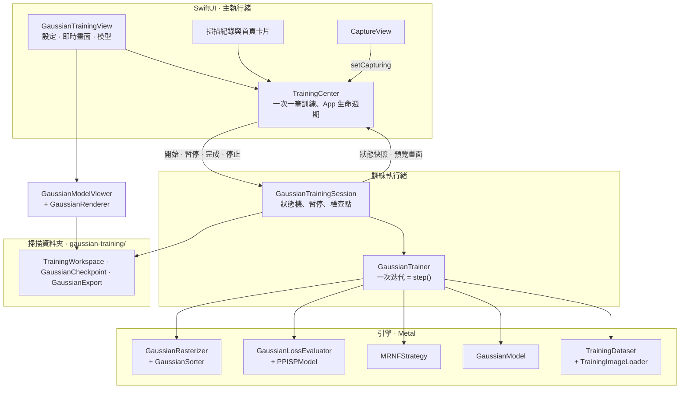
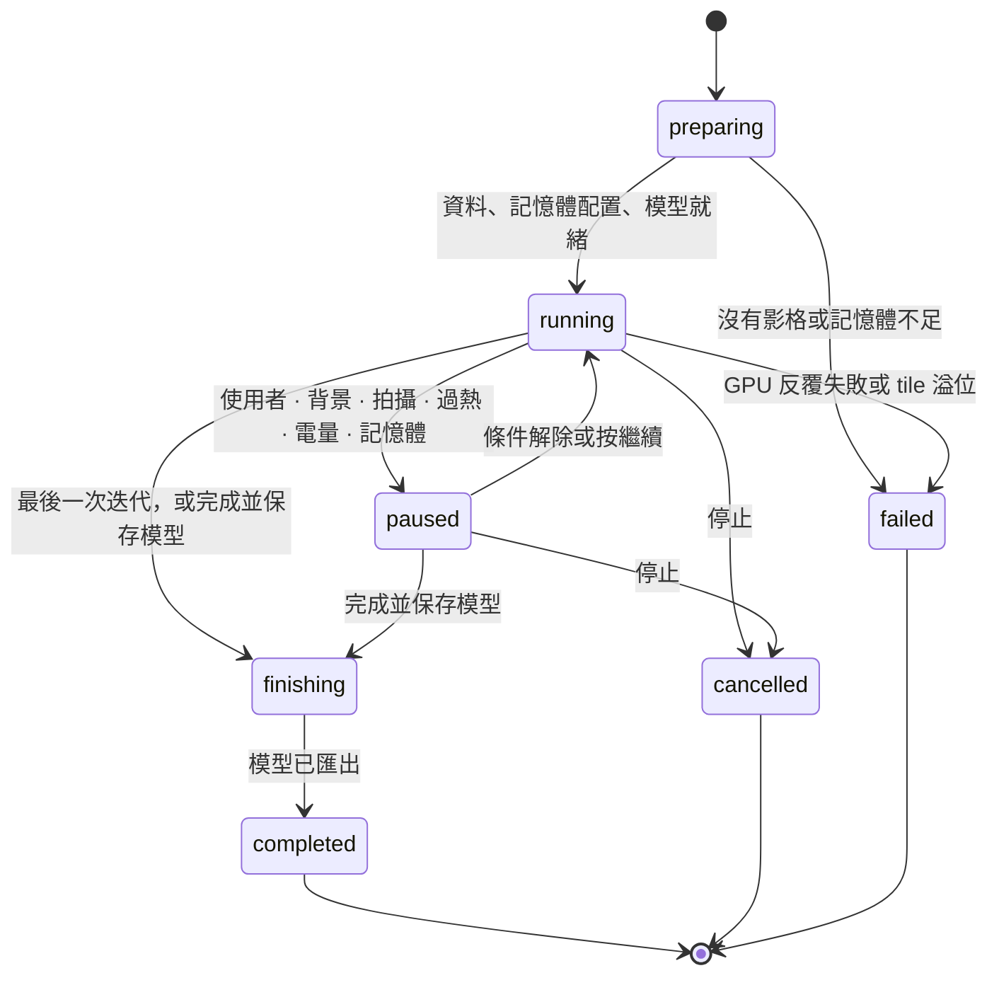

# 手機端 3DGS 訓練架構

[English](ON_DEVICE_3DGS_ARCHITECTURE.md) | **繁體中文**

這一頁說明手機端 3D Gaussian Splatting 訓練器的組成：分層、執行緒、每次迭代的 GPU 流程、資料配置、記憶體配置、檔案與測試。使用方式、訓練方法與實測結果，請見[手機端 3DGS 訓練](ON_DEVICE_3DGS.zh-TW.md)。

所有程式都在 `arkit-3dgs-scanner/Training/`，只用 Swift 與 Metal，不經過伺服器，也不含第三方程式碼（見[來源與授權](ON_DEVICE_3DGS.zh-TW.md#來源與授權)）。

## 分層

| 檔案 | 職責 |
| --- | --- |
| `GaussianTrainer.swift` | `GaussianTrainingConfiguration`（品質預設、解析度分級、加強模型）、`PoseCorrection`，以及 `GaussianTrainer`：初始化（種子點、檢查點或已保存的模型）、`step()`、評估與預覽 |
| `GaussianTrainingSession.swift` | 在獨立執行緒上的訓練狀態機：控制、自動暫停、檢查點、即時畫面請求、完成與匯出模型 |
| `GaussianModel.swift` | 固定容量的參數、梯度、Adam 與統計緩衝區；空出列的重複使用 |
| `GaussianRasterizer.swift`、`GaussianSorter.swift` | 相機與緩衝區配置、投影、tile 分箱、前向混合與反向傳播；GPU 前綴和與 radix 排序 |
| `GaussianLoss.swift`、`PPISP.swift` | L1 + D-SSIM 損失與 MRNF 誤差圖；PPISP 色彩模型（參數在 CPU，逐像素運算在 GPU） |
| `MRNFStrategy.swift` | 排程、學習率、場景範圍與密化（修剪、替換、生長、補洞種子） |
| `TrainingDataset.swift` | 影格選擇、保留影像、種子點雲與 LiDAR 深度種子、相機、LiDAR 深度目標、串流解碼影像 |
| `TrainingMemoryPlan.swift` | 有溢位檢查的記憶體配置與自動預算 |
| `GaussianCheckpoint.swift` | 可續訓的 `checkpoint.gsck` 格式 |
| `GaussianExport.swift` | PLY 寫入與讀取、中繼資料、`ppisp.json`、COLMAP 座標系轉換 |
| `TrainingWorkspace.swift` | `state.json`（`TrainingRecord`）、資料夾結構、刪除與捨棄規則、分享壓縮檔 |
| `GaussianRenderer.swift`、`GaussianModelViewer.swift` | 以環繞相機渲染預覽與已存模型 |
| `GaussianMetal.swift` | 裝置、pipeline、緩衝區與精簡的 dispatch 輔助 |
| `*.metal` | Kernel：`GaussianRaster`、`GaussianSort`、`GaussianLoss`、`GaussianOptim` |
| `UI/TrainingCenter.swift` | 全 App 唯一的訓練擁有者：生命週期與記憶體監聽、電池、螢幕常亮、背景繼續 |
| `UI/GaussianTrainingView.swift`、`UI/GaussianViewport.swift`、`UI/TrainingPresentation.swift` | 訓練畫面、手勢檢視區，以及共用的文字、卡片與速度紀錄 |

## 執行緒與擁有權

- **主執行緒：**
  - `TrainingCenter` 是 `@MainActor` 單例，同一時間最多只啟動一筆訓練，並把狀態快照轉給 SwiftUI。
  - 它監聽 App 狀態與記憶體壓力（`DispatchSource`）、追蹤電量，訓練期間讓螢幕保持常亮。
  - iOS 26 上，它也負責 `BGContinuedProcessingTask`。
- **訓練執行緒：**
  - 專用的 `Thread`（user-initiated QoS、4 MB 堆疊）執行 `GaussianTrainingSession.run()`。
  - `GaussianTrainer` 只在這條執行緒上使用。
  - 控制項（暫停、繼續、存檔、完成、停止、背景、拍攝、記憶體）是同一個 `NSCondition` 保護的旗標，迴圈在每次迭代之間讀取。
  - 狀態快照每秒最多送回主執行緒四次。
  - 預覽在迭代之間於這條執行緒渲染：平時每 1.5 秒一次，使用者操作相機時每 0.08 秒一次。
- **影像解碼：** `TrainingImageLoader` 在序列 queue 上把掃描的 JPEG 解碼成訓練解析度的 RGBA8，預先讀取下一個視角，快取最多三張，不寫入任何檔案。
- **已存模型檢視器：** `GaussianModelViewer` 在自己的 queue 上渲染，只保留最新的相機請求。
- **GPU：**
  - 只用一個 command queue。每個階段是一個 command buffer，執行緒會等它完成，所以階段之間可以讀回少量結果（交點數、損失總和、姿態梯度）。
  - 較長的運算會拆開送出，避免單一 command buffer 跑太久而被 GPU 看門狗中止（見[一次迭代](#一次迭代)）。

## 一次訓練的完整流程

1. **準備（`execute`）：**
   - `TrainingDataset.prepare` 選擇影格、標記保留影像、讀取種子點雲（`review.ply`，沒有則用 `points.ply`），並加入 LiDAR 深度種子。
   - `TrainingMemoryPlan.fit` 決定所有緩衝區的大小。續訓必須放得下檢查點的列數，加強模型必須放得下已保存模型的高斯；否則會停止並說明需要多少記憶體。
2. **初始化：** 三種方式之一。
   - 新的訓練：從點雲產生種子。
   - 續訓：讀取 `checkpoint.gsck`。
   - **加強模型：** 以 `initializeModel(fromSaved:)` 讀取 `model/`，把 PLY 轉回 ARKit 座標系，依影格 id 把微調後的姿態換回修正量，並讀回 `ppisp.json`，再從已保存的迭代接續排程。
3. **迴圈：**
   - 每次迭代前檢查：控制項、記憶體、溫度與電量。
   - 執行 `trainer.step()`。
   - 每 1,000 次迭代或 180 秒存一次檢查點，每次暫停時也會存。
4. **完成：**
   - 評估保留影像。
   - 把模型資料夾寫到暫存目錄，再以原子替換換上。
   - 刪除檢查點，儲存完成紀錄。
   - 新的訓練或加強只會在這一步取代已保存的模型；以「刪除」停止時，會恢復已保存模型的紀錄。
5. **失敗處理：**
   - 參數更新前 GPU 失敗時，跳過該視角。
   - 連續三次就回報錯誤：工作階段會退回最後的檢查點；在前景反覆失敗則停止訓練。
   - 在背景失去 GPU 時，改為暫停。

## 一次迭代

`GaussianTrainer.step()` 依打亂後的 epoch 順序，每次訓練一個視角。每個編號階段是一個 command buffer；反向傳播則是每段一個。

| 階段 | 位置 | 工作（kernel） |
| --- | --- | --- |
| 密化 | CPU | 在密化期間每 `refineEvery` 次迭代，由 `MRNFStrategy.refine` 直接修改共用緩衝區中的列（修剪、替換、在成長漸進的上限內生長、補洞種子、範圍，以及可選的重新分配）。此時 GPU 閒置 |
| 1. 投影 | GPU | 把上一次反向傳播併入統計並加上位置雜訊（`mrnf_fold`、`mrnf_noise`）。建立照片的邊緣圖（`edge_blur`、`edge_sobel_nms`）。投影每個高斯：EWA 共變異、SH 顏色、Mip 濾波、可選的拍攝運動，並逐列計算橢圓實際碰到的 tile 數（`project_forward`）。依深度排序（`iota_uint`、32 位元 radix）。計算 tile 數的前綴和（`gather_uint`、`scan_block`、`scan_add`）。記錄畫面佔比（`screen_share`） |
| 讀回 | CPU | 交點數。超過容量時跳過這個視角並停止生長 |
| 2. 前向 | GPU | 正規化邊緣圖（`scale_float`）。只為每個橢圓實際碰到的 tile 產生（tile, 高斯）配對（`emit_intersections`、`tileRowSpan`）。穩定的 16 位元 tile 排序（保留深度順序）。找出各 tile 的範圍（`tile_ranges`）。以 16 × 16 tile 由前往後混合，並輸出深度（`rasterize_forward`）。接著在同一個 command buffer 算損失：可選的 PPISP（`ppisp_forward`）、0.8 · L1 + 0.2 · D-SSIM（`ssim_forward`、`ssim_backward`）、梯度反向通過 PPISP（`ppisp_backward`），以及 MRNF 誤差圖。CPU 同時準備這個視角的 LiDAR 深度 |
| 3. 反向傳播 | GPU | 以每段最多 2,048 個 tile、每段一個 command buffer，逐 tile 反向重播；第一段同時清除梯度。960 × 720 分 2 段，1,920 × 1,440 分 6 段（`rasterize_backward`，含 LiDAR 深度損失）。每個 SIMD 群組以 16 次 shuffle 加總 32 個像素對每個高斯的 13 個值（`simdSum16`），再以 device atomic 累加。接著從畫面空間算到 3D 參數與相機姿態的梯度（`project_backward`）；密化期間也在這裡累加這個視角的重新分配統計（`relocation_fold`），免得之後的預覽渲染先覆寫它的 tile 數 |
| 4. Adam | GPU | 六組參數的 `adam_step`，含 MRNF 不透明度正則、密化期間的尺度模式與畫面佔比懲罰 |
| 更新 | CPU | PPISP 梯度與 Adam（每張影像 9 個參數、每台相機 27 個）。姿態微調開始後，對這個視角的姿態修正做一次 Adam 更新 |

生長、SH 階數、學習率、姿態微調與 PPISP 的暖身都依 `MRNFSchedule`；它把 LichtFeld Studio 以 30,000 次迭代為準的時間點，按訓練長度等比例縮放。

## 資料配置

**`GaussianModel`：**
- 以陣列結構（structure of arrays）存放，每種用途一個緩衝區（`params`、`grads`、`adamM`、`adamV`），配置都相同：

  | 群組 | Float 數 | 存放方式 |
  | --- | --- | --- |
  | means | 3 | 公尺，ARKit 世界座標 |
  | scales | 3 | 對數 |
  | quats | 4 | wxyz，由 kernel 正規化 |
  | opacities | 1 | logit |
  | sh0 | 3 | DC |
  | shN | 3 · ((d + 1)² − 1) | 高階係數，3 階時為 45 |

  SH 3 階時每個高斯共 59 個 float。
- `stats` 每列有九個平面：可見度、誤差最大值、邊緣總和、畫面佔比最大值、目前佔比、是否使用中，以及供重新分配使用的「畫面範圍涵蓋它的視角數」、誤差總和與「連續低貢獻視窗數」。除了最後一個，其餘在每次密化後歸零。
- **容量：** 由記憶體配置固定。被修剪的列會設成零四元數，光柵化器會略過它們，並在模型成長前優先重新填入，所以密化永遠不會配置新記憶體。

**光柵化器：**
- **每個高斯：** 投影中心、conic、顏色、tile 數、範圍矩形、深度鍵值、排序順序，以及 `grad2d`。`grad2d` 有 13 個 float：dx、dy、dA、dB、dC、dOpacity、dRGB、Σw、Σw·誤差、Σw·邊緣、dDepth。
- **每個交點：** 鍵值、值與排序暫存。

**每個高斯容量的位元組（SH 3 階）：**

| 緩衝區 | 位元組 |
| --- | --- |
| 模型：59 個 float × 4 個緩衝區 + 6 個統計平面 | 968 |
| 光柵化器 | 136 |
| 交點：每個高斯 10 個 × 18 | 180 |

合計約 1.3 KB；600,064 個高斯約 730 MiB。影像、損失與預覽另外佔用與解析度相關的空間（見[記憶體保護](ON_DEVICE_3DGS.zh-TW.md#記憶體保護)）。

## 記憶體配置

`TrainingMemoryPlan.fit` 以有溢位檢查的算術，找出放得進預算的最大高斯容量（1,024 的倍數，且不超過要求的上限）。

- **計入的項目：**
  - 模型、光柵化器與交點緩衝區；
  - 逐像素緩衝區：渲染目標、損失、SSIM 與 PPISP 平面、目標影像、邊緣圖；
  - 三張解碼後的影像與預覽；
  - 160 MB 固定開銷，涵蓋 pipeline、command buffer、CPU 端的密化陣列與 App 本身。
- **自動預算：** 程序仍可配置記憶體的 55%，扣除 450 MB 保留空間，並受裝置等級上限限制。
- **訓練期間：**
  - 容量永遠不會增加。
  - 檢查點以 8 MB 為單位串流寫出，PLY 匯出以 4 MB 為單位。
  - 收到記憶體警告時停止生長並清空影像快取；記憶體嚴重不足時存檢查點並暫停。
- **檢視器：** 已存模型的檢視器會在讀取前自行估算所需記憶體。

## 座標系

- **訓練：** 在 ARKit 世界座標（公尺、Y 朝上）中進行。每台相機的世界到相機矩陣，由記錄的相機到世界變換翻轉相機的 Y、Z 軸而來：ARKit 的 OpenGL 相機（y 朝上、看向 −z）轉成光柵化器使用的 OpenCV 相機（y 朝下、看向 +z）。世界座標軸不變。
- **姿態微調：** 在各自的相機座標系中修正每個視角：w2c′ = [R(ω) | τ] · w2c，並以先驗讓它維持在 ARKit 姿態附近。`training-poses.jsonl` 以 ARKit 慣例儲存修正後的相機到世界變換。
- **匯出的 PLY：** 使用 COLMAP 匯出座標系，也就是 ARKit 世界座標繞 X 軸轉 180°：
  - 位置變成 (x, −y, −z)；
  - 四元數跟著旋轉；
  - 高階 SH 係數依各基底函數的奇偶性改變正負號。
- **讀回 PLY：** 檢視器與加強模型會反向還原這些步驟。

## 檔案

| 檔案 | 寫入時機 | 格式 |
| --- | --- | --- |
| `state.json` | 每次狀態改變與存檢查點時 | `TrainingRecord`：狀態、原因、設定、迭代、高斯數、指標、時間、記憶體。停在「running」的紀錄會顯示為「中斷」 |
| `checkpoint.gsck` | 每 1,000 次迭代或 180 秒、暫停時、使用者要求時 | 魔術字 `GSCK`，接著是 JSON 標頭與資料本體（見下方）。先寫入暫存檔，再以原子方式改名 |
| `snapshot.jpg` | 每次存檢查點時 | 續訓畫面上的圖片 |
| `model/` | 完成時 | `gaussians.ply`（INRIA 格式、COLMAP 座標系）、`gaussians.json`、`ppisp.json`、`training-poses.jsonl`、`training-report.json`、`preview.jpg`。先放暫存目錄，再整個換上 |

**`checkpoint.gsck` 的內容：**
- **標頭：** 設定、資料集簽章、迭代、epoch 位置、列數、Adam 步數、`MRNFStrategy`、`PPISPModel`、姿態修正與已用時間。
- **資料本體：** 每個使用中列的參數，連同兩組 Adam 動量與七個統計平面（格式第 2 版）。只有四個平面的第 1 版檔案仍可續訓，三個重新分配用的平面從零開始。
- **完整性：** 64 位元 FNV-1a 校驗碼與結尾標記，檔案被截斷或損毀時會拒絕讀取。
- **簽章：** 由解析度，以及每個影格的 id、影像、是否保留、內參與姿態算出的雜湊值。檢查點只能在相同的輸入上續訓。

## 與 App 其他部分的整合

- **入口：** 掃描紀錄與拍攝完成畫面上的訓練卡片，會開啟該掃描的 `GaussianTrainingView`。
- **掃描紀錄：** `ScanLibrary+Training` 讀取 `state.json` 顯示卡片狀態。正在訓練的掃描不能刪除。
- **拍攝：** `CaptureView` 呼叫 `TrainingCenter.setCapturing`，拍攝期間 ARKit 與融合需要 GPU 與記憶體，訓練會先暫停。
- **首頁：** 「掃描紀錄」卡片顯示進行中訓練的進度。
- **背景（iOS 26 以上）：**
  - 開始或繼續訓練時，會送出需要 GPU 的 `BGContinuedProcessingTask`，其識別碼由 `Config/Info.plist` 允許。
  - 沒有「Background GPU Access」功能，或 iOS 結束背景時間時，訓練會存檢查點並暫停。
- **資料集匯出：** COLMAP 匯出會略過 `gaussian-training/`；模型另有自己的 `scan_…-3dgs.zip`。

## 測試與工具

執行 `bash tools/test_gaussian_training.sh`，會以 App 的 Metal 原始碼，在 Mac GPU 上建置並執行下列所有測試。

| 工具 | 涵蓋內容 |
| --- | --- |
| `tools/test_gaussian_raster.swift` | 前向渲染對照雙精度 CPU 參考實作；以有限差分驗證參數與姿態梯度（Mip 濾波、拍攝運動、LiDAR 深度損失）；分段反向傳播與一次算完相同（20 項） |
| `tools/test_gaussian_loss.swift` | 損失、影像與 PPISP 梯度（7 項） |
| `tools/test_gaussian_training.swift` | 59 項端對端檢查：記憶體配置、解析度分級、MRNF（含成長漸進與重新分配）、匯出座標、收斂、加強模型、PPISP、姿態、拍攝運動、深度種子、補洞、檢查點（含第 1 版）、工作階段狀態機、檢視器、壓縮檔，以及 1,200 張影像的訓練。`GS_ONLY=session,enhancement` 可只跑部分測試 |
| `tools/train_gaussians.swift` | 在 Mac GPU 上重跑真實掃描，每個實驗都有開關，例如 `--long-edge`、`--align-eval`、`--eval-full-res`、`--holdout-segment`、`--save-model`、`--enhance-from`、`--depth-loss`、`--per-frame` |

Mac 上的結果無法代表 iPhone 的速度、記憶體或發熱，這些都需要實機測試。

## 擴充訓練器

- **新的緩衝區：** 每一個都要計入 `TrainingMemoryPlan.components`，否則配置就無法限制整個訓練的記憶體。
- **新的設定欄位：** 宣告成 optional，舊的 `state.json` 與檢查點才能繼續解碼。
- **新的逐高斯參數：** 同時修改 `GaussianLayout`、檢查點（提高版本號）以及 PLY 的寫入與讀取。
- **修改 kernel：** 擴充 `test_gaussian_raster.swift` 的有限差分檢查，並同步更新 CPU 參考實作。
- **較長的運算：** command buffer 會隨解析度或模型大小變長的運算都要拆開送出，就像反向傳播分段那樣。
- **使用者看到的文字：** 使用 `L10n`，並在 `en.lproj` 與 `zh-Hant.lproj` 都加上對應字串。
